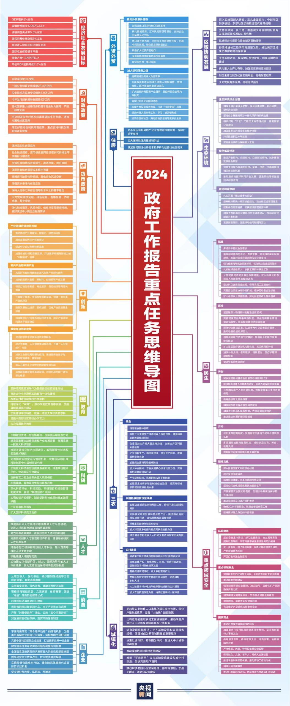

# 论商业

结构效率战略

- 预知风口、找风口

经营战略

- 收入哪来、成本去哪
- 找谁合作分摊收入和成本

经营战术

- 招什么人、做什么产品、什么文化、组织架构、规章制度

——

和想对标的大牌会员店的区位差异、消费能力和习惯的差异，对会员店SKU的精选和供应链的把握能力，对服务改造和品牌升级的真实意愿和实现能力，是否具备，

——

而细细研究力帆发布的财务报表，从开始“借鉴之路”后，力帆的研发投入再未超过10亿元，一个远远低于行业其他品牌的数字。
—言传身教，修身影响继承人，继承人影响未来
人生最难走的路，往往是那些“捷径”—没有什么获得，不需要付出代价/成本，只是当时没被看到
——

——
资产和负债的区别（增值还是贬值）
慢慢变富
转移风险

——
双赢的意思呢？成本被转移到哪了？还是其实不存在双赢，只是亏的一方把一时的亏损视为投资，然后以后赢回来？还是说本来就是个骗局，本来就是一方占便宜一方吃亏？但这是不是回到了“天下的财富”是有总数的这个错误结论上？财富是让劳动时间被更高效的利用起来？
—双赢是提升劳动时间利用率低的一方的劳动时间利用率（收益率），然后双方分额外收益的那部分？

——
战争胜利的关键是，调兵遣将，以少对多的地方不打，确保在局部能出现以多打少的歼灭战，然后合理选择关键局部，形成包围、截断、分割，不断积局部小胜成为大胜。
战争—革命战争—中国革命战争
在战争的基础规律上，在追加革命战争，中国革命战争的规律，这是一般性和特殊性来分析本质。特殊性和一般性又分为好几层，要分析每一层的一般性和特殊性。
生意，软件生意，企业服务软件生意，saas企业服务软件生意，无代码saas企业服务软件生意。（由于质变）
中国上海、城市、城镇，2023年，大客户小客户，收益，成本
各个层次，方面的一般性和特殊性

——
长期有效的利润，而不是短期的大富大贵
——
合伙人制—扩张逻辑
——
三个故事—还没开始干活就已经走进了别人的思路
——
稳定加增长—空间和预期
——
对公司的定位如何——腰部公司的弹性，1亿到10亿的增长比100亿到1000亿的增长容易让人相信的多
——
发币权比现金更重要
——
定位，预期，相信 资本市场就是让人如何对你的未来充满信心，然后以此得到钱，资源，去完成你想做的事情
——

——
经济政策时说，一时走得快不一定走得稳，只有走得稳才能走得有力。
—稳定和想象空间

——

——
赏别人饭吃的时候，对拎不清的人，同时得准备棒子
——
伤害过后，再无原谅
——
成名前，积累人脉和资源，成名后，更是资源和人脉，强强联合，合纵连横
——
遵守规则的强大，永远跳不出这个规则，打铁还要自身硬
——
广泛的接触和伟大的交流—种族和文化的繁衍和进化，学习需要多接触，多交流，多辩论。各路英杰的广泛对话—信息茧房（算法推荐，热搜不感兴趣也不看）
——

——
自己的根基：相熟的投资方，相熟的渠道，相熟的开发团队，相熟的班底，相熟的疏通关节。大多数，多个朋友多条路，也是牵绊，交友圈，归属的互相互斥。人情和人情债。坏规矩的人谁都不会要。

——
任何圈子都是大鱼吃小鱼，小鱼吃虾米，大鱼才能和大鱼对话，烂泥只能和烂泥对话。黑暗丛林

——
火了就一定会被抄袭

——

结构效率层面的战略突破。
顺势（全局周期未来：人均收入）和借力（产业资本政府）（越好的事情帮自己的人越多，越干不起来的事情，往往只能一个人干）。
越是大生意越
——

——
所谓商业模式其实是一种专业的分工和利益的分配模式（成本载体成本结构和收入来源，风险来源，资产组成，收益模型）。一种商业模式能否成功、能否持续成功，在于是否具备纵观全局和前瞻性视野，在于对现状的认知、终局的判断和发展路线思考是否符合事物发展规律。所以很可能现阶段这种模式可行，下个阶段就需要换另外一种模式。

——

虽然现在大环境不如以前，但是好的行业依然有，比如新能源、AI、软件国产化、高端制造业、出海、短视频等等。

——

快鱼吃慢鱼，抢占先手优势（第一印象，用户心智，生态位），占据核心垄断资源和合作方，夺得稀缺性乃至唯一性

——

看来互联网最赚钱的生意，又回到了他的本质：信息传播（连接）。

——

前代富豪们的五大特质：有眼光、胆子大、领导才能、坚持、和运气。

过去，这些特质催生出一个个“首富”。后来，他发现一些特质行不通了，变成了创新、资源整合、速度。

仅仅依靠胆识和魄力创造财富的时代已经过去，当下更多有学识、有创新技术的人，才能真正创造财富。例如互联网行业，有技术的程序员，已经成为了最炙手可热的相亲对象。

——

另外一个是，2020年，全球经济剧烈动荡。到了下半年，胡润惊讶发现，很多从前的富豪，身价反而越来越高。

他从未见过全球富豪财富增长如此快速的情景。他很好奇，怎么大家都赚不到钱的情况下，有人的身价反而增加了这么多？——

获奖的是确保相互摧毁，而不是我们的和谐和共赢理论，因为这是世界运行的真谛，是现实世界和理想世界的差距。

——

感觉中国的教育方式，总是过早的让学生接触到了理性认识，而不是让学生先从感性认识开始。

缺乏感性认识的理性认识，无法理解。

感受到的才能理解，理解的才能更好的感受。

——

资源的利用方式（高效，颠覆式），碾压了资源本身

——

衣食住行
生老病死
党政能源交通教育物流
工业化信息化智能化

——

https://mp.weixin.qq.com/s/5MJVCDOwe7lrE8uI2tlpRg

——

——
经历过友军有难不动如山，和支援要从我的地盘经过，先交过路费之后，就会自然的希望多个朋友多条“生”路

——

生产力主要还是在衣食住行。
实物生产，万物互联。
