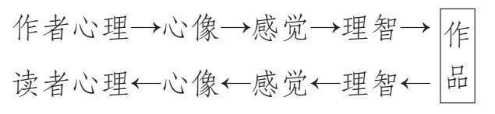

——
小说、评书、京剧、相声、电视节目、音乐、电影，都是现成的例子
内容不可脱离生活

——
乡土情节，好的故事永远要立足现实，而非靠想象

——
构建世界观（完善），表达精神内核

——
剧本，言之有物，言之有序，言之有理，言之有情，每一个镜头都要有意义

——
看不到的东西只能依靠想象，想象的一定的虚浮的

——
娱乐性和艺术性（73）。娱乐性的需求客观存在，而且需求广泛存在。
孤阴不长，孤阳不生。

——
新人导演+无名演员+冷门题材=扑街
——
故事中，主角的特质，贯穿始终的特质（精神内核）

——
如果人物是在一个兴高采烈的状态下，那么他眼里出现的所有事物都是带着喜感的，带着美好的感受；当一个人物生命状态很差的时候，他看到同样的事物可能感受就不一样。你要通过这样一些方式，调动你自己全部的感官和你的联想能力，实际上这也是作家写作的时候，所依据的最基本的一个方式。
——
如果一个作家的生活过得无滋无味，那么写出来的东西也必然是乏味的。
——
要写人，得接近人，关心人，了解人，而且爱人。

——
修仙，是一条有进无退的路，不修仙还有魂魄转世，修仙之后，死则魂飞魄散

——
角色和世界观交织的那种强烈印象，在观看的瞬间脑中就立刻被填满了的那个印象，所以我的目标是能画出被大家深深铭刻在脑海中有印象的作品
——
剧情大纲和氛围大纲
——
想法和冲动，写自己想写的

——
好的文字，一定是从心底里喷涌而出的。一篇连自己也感动不了的文字，又如何感动他人呢。
做早点和做学问是相通的，都需要精益求精的精神。在我眼里，从手中的擀面棍下出来的，不是油条和馒头，而是一枚枚精准无误而又完美无瑕的火箭。

——
这样残酷的两难，造成观众情感上的巨大冲击，展示整个复杂的人性。戏剧本质上便是一连串的冲突

——

破题，主干（大方向）

——
景色相同，观者心境不同，看到的也不同
——
文字追求的永远是传达一种感觉，感受，感同身受

——
讲故事，先介绍人物，再介绍剧情，不要很早开始介绍背景，背景在剧情推进的过程中慢慢带出

——

——
主题:学习写作&读书笔记&写作主题阅读02
导读:无法写作的“四宗罪”（第1章）→对应破解的四个法门（积累素材/第2章、锻炼叙述方法/第3章、锤炼语言和逻辑/第4章、掌握写作套路/第5章）
一、写作的四个难题
·不知道写什么（需要:素材）
·写不下去（需要:叙述方法）
·写的乱（需要:语言和逻辑）
·有内容，但写不出来（需要:写作套路）
二、积累素材（化解:不知道写什么）
素材:生活感受、新闻采访、读书笔记、网络搜索
1、生活感受
·照片还原发法:用眼睛拍照，并用文字把“照片”还原出来
要点:记录细节+融入自己的感受
·“知情意”法:详见案例
eg:杂菜包子（从食物到内心）
1.1这个食物有什么故事？
1.2这个食物什么特别之处？
1.3这个食物的做法。
1.4这个食物的味道。
1.5跟这个食物有关的人和事。
1.6这个食物带给你的感触。
1.7所有跟这个食物有关的感想。
1.8因为这种感触，你接下来的打算。
1—5是食物本身的故事（知:知识），
6—7是食物带来的情感（情:感情），
第8条是有感而发后的行动（意:意欲）。
这三部分，可以概括为事实、感情和行动。
2、新闻采访
·应用领域（新闻采访法）:市场调查、用户研究、口述历史，甚至对家人回忆的采集。
·步骤:准备（准备清单、采访提纲）→采访（采访记录表格）→整理（核对、补充、整理）
3、读书笔记
·如何做读书笔记:摘要（好的句子、段落、图表等摘录）+感触（边读边想的感悟）+延伸（阅后书评）
·整理:首先整体分类，其次加查阅标记（索引）
·应用:把外界的素材，真正内化成可以被自己所用的资料。
4、网络搜索
注意事项:网上公开的资料往往不是第一手资料也没有唯一性，很多资料没有经过求证。
三、锻炼叙述方法（化解:写不下去）
叙述方法:故事叙述、金字塔式、脑洞大开式
1、故事叙述法
·时间推移法:制作时间表格（时间轴线-事件-前后衔接关系）
·事件脉络法:制作事件流程表（出场人物-场地-事件）
·主旨发散法:内容都围绕一个核心点，所有的内容都是核心点的延伸。
2、金字塔式
·先说结论，再解释原因
·先分级，再找到层级关系
·论点（一级）→分论点（二级）→解释论据（支持）
3、脑洞大开式
需注意:要有想象力+要有逻辑性+要有衔接性
四、锻炼语言和逻辑（化解:写的乱）
1、如何开头
·故事开头:讲一个故事
eg:电影《重庆森林》“我”和阿May的故事
·总结开头:先抛出结论
eg:一篇“我觉得我会报复社会，因为这个社会报复了我太多次……”
·悬疑开头:勾起好奇心
eg:《百年孤独》的“多年以后，面对行刑队，奥雷良诺·布恩地亚上校将会回想起，父亲带他去见识冰块的那个遥远的下午。”
·自然开头:讲最开始想讲的话
eg:鲁迅《秋叶》“在我的后园，可以看见墙外有两株树，一株是枣树，还有一株也是枣树。”
2、如何连贯
先列提纲，如何开头，中间有几点，引用哪些资料，提供哪些数据。
3、整体内容布局
故事的开头，引入人物，占20％
故事的发展，展开事件，占30％
故事的结尾，占10％
对故事的联想及感慨，占20％
反思，占20％
eg:电影《釜山行》，冲突是重点，前铺垫和后反思轻度必需。
4、如何结尾
·结尾的地位:所有前面的铺垫都是为结尾服务的。
·结尾的四种形式：恍然大悟式、开放式、揭秘式、场景式。
五、模板写作法（化解:有内容，但写不出来）
模板类型:通知类、分析类、计划类和总结类
1、通知类模板
通知主体→通知内容→通知对象→注意事项→执行办法。
eg:“公司（主体）通知全体员工（对象），国庆节放假三天（内容），如有离京同事，需向人事部报备（注意事项），请各位配合执行为要（执行办法）。”
2、分析类模板
摘要→陈述→对比→分析→建议→参考资料附录
3、计划类模板
·个人计划:梳理自己（优势与短板）→目标分解→需要的资源
·商业计划书:市场和行业趋势＞潜在商业机会＞产品设计（功能、定价、渠道、营销策略）＞财务和融资状况＞法律及合规＞使命与愿景＞市场容量＞核心诉求提炼市场验证＞下一步发展计划＞风险评估＞经营团队
4、总结类
金字塔式总结:中心论点→分论点→内容
寄语
当你相信写作就是说话，写作就变成了一个自然的事。

——

——
放下心中的傲慢与偏见，活在自己的世界里创作一文不值

——
小说：意外的冲突和矛盾

——
文学，在逻辑的基础上，更看重感觉，通过文字传递的感觉

——

人需要的是体验、感受、新体验、新感受，所以文字给读者带来的也是新感受、新体验

——
内容储备和写作习惯，想法变成文字
写作练习，写作词库和习惯
高强度仿写练习
掌握读者喜欢至少不排斥的写法套路（情节原创，表述方式按套路）
套路打磨，爽点发掘，剧情节奏控制

——
在他看来，一个合格的媒体首先要在第一时间告诉它的读者发生了什么，同时再告诉他们，正在发生的新闻意味着什么，这是“我们的工作”。（材料，观点）
媒体追求的核心能力唯有两个：一是速度，二是态度。若有前者，可获得读者和商业价值；若有后者，便可卓尔不群。
——
写作没有什么诀窍，就是多练习。不要盲目相信最近新出的那些AI写作程序。有感情、有个性、有特点的文章，只有人类自己才能完成

——
人物文化故事技法

——
为什么好画家都极端感性？也许是因为画作乃至艺术，都是在传递一种感受，必得自己先心有所感，感受极深，才能通过文字颜料等载体传递自己的这种感受

——

很多人误以为所谓写写画画之类的工作，甚至所有的脑力工作，生产者的内容都是存在脑子里的。

有需要了拿出来就用，画画、写字都是打开水龙头放水，内容本来就在那放着，只要开始动了，就像打开了水龙头，直接就流出来了。

所谓的拖延，来自于你想不想出力拧，问题的困难在于你想不想开干，拖延就是不重视、没上心。

其实完全不是这样的。

创作是拼乐高，素材和碎片在脑子里，但是拼起来，梳理出逻辑、按要求呈现才是困难的事情。

工作开始之前，命题是高达、是凡尔赛宫，再回头一看，现实是平铺的几万个零件，密密麻麻心里都是绝望和压力，耳边回荡的是：你不是在幼儿园用积木拼过小汽车吗？

当终于鼓起勇气，颤颤巍巍拿起一块儿头，一拼起来发现是屁股，屁股拆下来发现放在嘎吱窝也行，这才是绝望的来源。

创作的困难来自于秩序的梳理，有序的呈现，东西都知道，想法都在那里，但整不出来才是常态。

——

文笔，思想，故事

外在，内核的统一

————

写 10 遍，不如改一遍

——

言之有物，更重要的是有态度（自己的立场、观点）

——

围绕教学目标，讲清楚操作步骤，步骤引起的变化，实验者的心情感受这三件事的目的，以及具体怎么样把这三件事讲清楚的方法。

图表辅助记录步骤（大纲）是一种好的方法

——

每个人重视的学习的创造的，一定是自己所处的环境最需要的—创作逻辑

——

“有反转”“有共鸣”“看到你的视频，能看到自己”。

**所有读者，看到的关注到的感受到的，都是自己**

读者看的是自己、看的是自己想看的，而不是作者想看的

——

未来的规划，目标就是境界提升，长生不老，手段就是获取丹药，获取功法，提升境界

——

同一个功法，同一条道，不同的人走，也是千人千道

——

我们所欣赏的、渴望拥有的特质 ta 们拥有，在某种程度上， ta 们还集合、实现了我们的理想。

在 ta 身上，我们看到了期望中的自己。那些深深打动并吸引我们的特质，可能恰好是我们渴望自身所拥有的，我们通过 ta 得以看见自己理想的投射。

——

不打仗，不打架，不克服困难，就没什么好看的，可见看书也是主要感受新体验，解决新问题就是新体验

——

——

观察力，想象力，生活经验

——

可能创作的天赋，就是表达的欲望吧

创作者大多不快乐，因为创作其实是一种天赋，创作的天赋就是敏感，这种敏感也会导致你的情绪会比别人多，会比别人猛烈。”

——

那时的他还有“贪心”的心愿：“我表达我自己，我希望别人懂得我表达我自己。”

——

还有一个点，比较好的作者的创作习惯挺一致的，一般情况下都会写大纲和人物小传，把整个东西都构思好后再去做细节创作。我们把这个流程也加在了蛙蛙写作里面。

——

读者用户都是既要又要的，但是既要又要往往结果是都没做好，所以最后还是做好一方面，更好的吸引一部分人，排斥另一部分人，就足够了

——

一个人的创作黄金时间可能就只有几年，这个时候如果不做一点好东西的话，这辈子可能就没什么机会了

