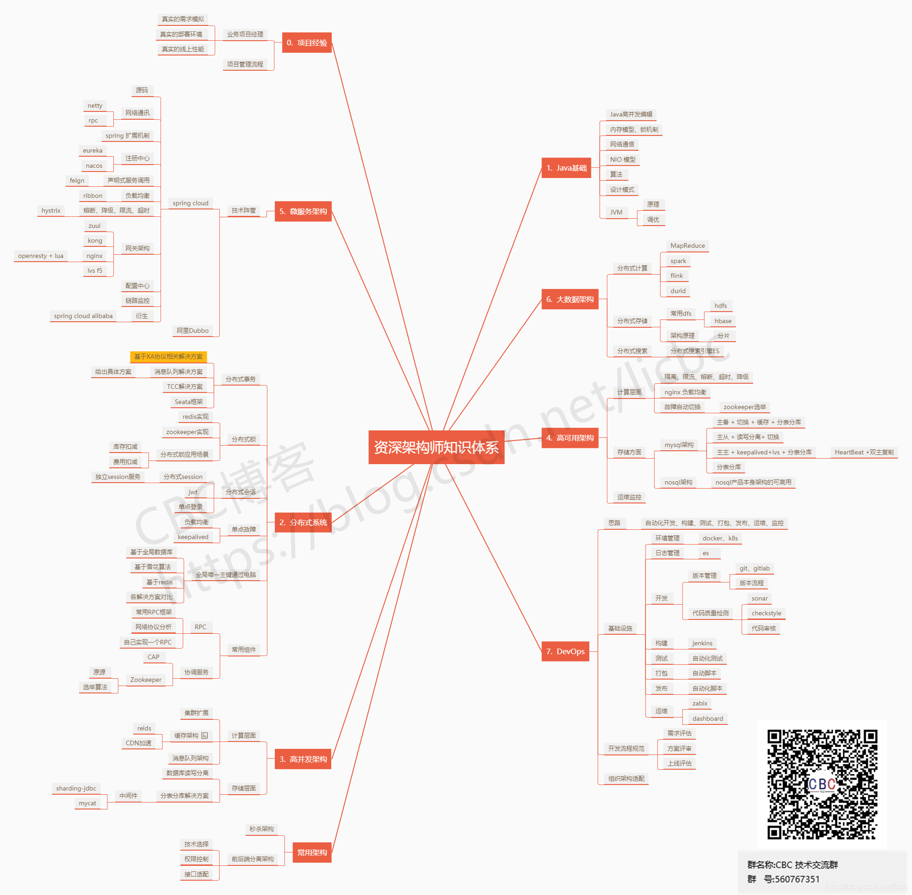

Java架构师主要需要做哪些工作呢？

　　1.负责设计和搭建软件系统架构（平台、数据库、接口和应用架构等），解决开发中各种系统架构问题。

　　2.优化现有系统的性能，解决软件系统平台关键技术问题攻关、核心功能模块设计、核心代码开发。

　　3.在项目需求不断细化的工程中校正整体的架构设计，以及详细模块拆分设计。

　　4.营造技术学习氛围，带领团队不断完善开发开发方法及流程，提升开发效率与质量，加强技术标准及规范。

　　5.带领团队攻克例如大数据量、高并发、高稳定性等带来的各种挑战及技术难关。

　　6.责任心强，有团队合作精神，工作认真负责高效并具有一定抗压能力。

　　7.参与讨论公司产品发展方向，完整的规划和把握产品研发架构。

 

　　**Java架构师要学习哪些知识点呢？**

 

　　希望以下的学习路线能对你有帮助

 

　　**1、并发编程**

　　**Synchronized的概念和分析**

 

　　同步、重量级锁以及Synchronized的原理分析

 

　　自旋锁、偏向锁、轻量级锁、重量级锁的概念、使用以及如何来优化他们

 

　　**Volatile和DCL的知识**

 

　　Volatile的使用场景和Volatile实现机制、内存语义、内存模型

 

　　DCL的单例模式，什么是DCL？如何来解决DCL的问题

 

　　**并发基础之AQS的深度分析**

 

　　AbstractAueuedSynchronizer同步器的概念、CLH同步队列是什么？

 

　　同步状态的获取和释放、线程阻塞和唤醒

 

　　**Lock和并发常用工具类**

 

　　java当中的Lock、ReentrantLock、ReentrantReadWriteLock、Condition

 

　　java当中的并发工具类CyclicBarrier、CountDownLatch、Semphore

 

　　java当中的并发集合类ConcurrentHashMap、ConcurrentLinkedQueue......

 

　　**原子操作常用知识讲解**

 

　　基本类型的原子操作比如经典的AtomicBoolean、AtomicLnteger、AtomicLong

 

　　数组类型的原子操作代表几个类AtomicIntegerArray、AtomicLongArray、AtomicReferenceArray

 

　　引用类型的原子操作的典型AtomicReference、AtomicReferenceFieldUpdater......

 

　　CAS的概念和知识、CompareAndSwap以及他的缺陷

 

　　**线程池和并发并行**

 

　　Executor、ThreadPoolExecutor、Callable&Future、ScheduledExecutorService

 

　　ThreadLocal、Fork&Join？什么是并行？线程池如何保证核心线程不被销毁？

 

　　**2、框架和源码应用**

****

 

　　**mybatis应用和源码解析**

 

　　mybatis优缺点、spring与mybatis集成

 

　　Config、Sql配置、Mapper配置、有几种注册mapper的方法，优先级如何？

 

　　mybaits的一级缓存、二级缓存、mybatis的二级缓存为什么是鸡肋？

 

　　通用mapper的实现、mybaits编写sql语句的三种方式

 

　　@MapperScan的源码分析？mapperScan如何生效的？

 

　　mybatis如何扩展spring的扫描器的、mybatis扫描完之后如何利用FactoryBean的？

 

　　mybaits底层如何把一个代理对象放到spring容器中？用到了spring的哪些知识？

 

　　mybaits和spring的核心接口ImportBeanDefinitionRegistrar之间千丝万缕的关系

 

　　从原来来说明mybaits的一级缓存为什么会失效？spring为什么把他失效？有没有办法解决？

 

　　从mybatis来分析mybatis的执行流程、mybaits的sql什么时候缓存的？缓存在哪里？

 

　　mybaits当中的方法名为什么需要和mapper当中的id一致？从源码来说明

 

　　**spring源码分析**

 

　　spring的基本应用和spring源码的编译

 

　　java混乱的日志系统，Jul、jcl、log4j、slf4j.....

 

　　spring4和spring在日志方面的源码对比

 

　　AspectJ和springAop，aspectj的静态织入

 

　　JDK动态代理的源码分析，JDK是如何操作字节码

 

　　spring通过cglib完成AOP，cglib如果完成方法拦截

 

　　AnnotationAwareAspectJAutoProxyCreator如何完成代理织入的

 

　　BeanDefinition是什么东西，sping当中的各种BeanDefinition的作用

 

　　BeanDefinition有什么作用？如果来改变一个bean的行为

 

　　BeanDefinitionRegistry的作用，源码分析

 

　　BeanNameGenerator如何改变beanName的生成策略

 

　　BeanPostProcessor如何插手bean的实例化过程、经典的应用场景有哪些？spring内部哪里用到了这个接口

 

　　BeanFactoryPostProcessor和BeanPostProcessor的区别、经典应用场景、spring内部如何把他应用起来的

 

　　BeanDefinitionRegistryPostProcessor和BeanFactoryPostProcessor的关系已经区别，spring底层如何调用他们

 

　　ConfigurationClassPostProcessor这个类如何完成bean的扫描，如何完成@Bean的扫描、如何完成对@Import的解析

 

　　@Imoprt的三种类型，普通类、配置类、ImportSelector

 

　　如何利用ImportSelector来完成对spring的扩展？

 

　　@Configuration这注解为什么可以不加？加了和不加的区别，底层为什么使用cglib

 

　　@Bean的方法是如何保证单例的？如果不需要单例需要这么配置？为什么需要这么配置

 

　　springFacoryBean和BeanFacory的区别，有哪些经典应用场景？spring的factoryMethod的经典应用场景？

 

　　ImportBeanDefinitionRegistrar这个接口的作用，其他主流框架如何利用这个类来完成和spring的结合的？

 

　　spring是什么时候来执行后置处理器的？有哪些重要的后置处理器，比如CommonAnnotationBeanPostProcessor

 

　　CommonAnnotationBeanPostProcessor如何来完成spring初始化方法的回调。spring内部的各种Procesor的作用分别是什么

 

　　spring和springBoot当中的各种@Enablexxxx的原理是什么？如何自己实现一个？比如动态开启某某些自定义功能

 

　　spring如何来完成bean的循环依赖并且实例化的，什么是spring的IOC容器，怎么通过源码来理解？

 

　　其他，比如Bean的实例化过程，源码中的两次gegetSingleton的不同和相比如SpringMvc的源码分析等等......

**
**　　**3、Spring微服务**

****

 

　　**SpringCloud**

 

　　Eureka的源码分析服务注册和服务发现以及心跳机制和保护机制，对比eureka与zookeeper，什么是CAP原则？

 

　　Ribbon源码分析和客服端负载均衡，客户端负载均衡？服务端负载均衡？Ribbon核心组件IRule以及重写IRule

 

　　Fegin源码分析和声明式服务调用，Fegin负载均衡，Fegin如何与Hystrix结合使用？有什么问题？

 

　　Hystrix实现服务限流、降级，大型分布式项目服务雪崩如何解决？服务熔断到底是什么？一线公司的解决方案

 

　　HystrixDoashboard如何实现自定义接口降级、监控数据、数据聚合等等

 

　　Zuul统一网关详解、服务路由、过滤器使用等，从源头来拦截掉一些不良请求

 

　　分布式配置中心Config详解，如何与github或是其他自定义的git平台结合、比如gitlab

 

　　分布式链路跟踪详解，串联调用链，,让Bug无处可藏，如何厘清微服务之间的依赖关系？如何跟踪业务流的处理顺序？

 

　　**SpringBoot**

 

　　SpringBoot的源码分析和基本应用、利用springmvc的知识模拟和手写一个springboot

 

　　springmvc的零配置如何实现的？利用servelt3.0的哪些新知识？在springmvc中如何内嵌一个tomcat，如何把web.xml去掉

 

　　springboot当中的监听器和设计模式中观察者模式的关系、模拟java当中的事件驱动编程模型

 

　　springboot的启动流程分析、springboot如何初始化spring的context？如何初始化DispacterServlet的、如何启动tomcat的

 

　　springboot的配置文件类型、配置文件的语法、配置文件的加载顺序、模拟springboot的自动配置

 

　　lspringboot的日志系统、springboot如何设计他的日志系统的，有什么优势？如何做到统一日志的？

 

　　Docker

 

　　什么是Docker、为什么要使用他、和开发有什么关系？能否带来便捷、Docker简介、入门，Docker的架构是怎样的？

 

　　Docker的三大核心概念：镜像（Images）、容器（Containers）、仓库服务注册器（Registry）他们分别是什么？

 

　　Docker的基础用法以及Docker镜像的基本操作

 

　　容器技术入门、Docker容器基本操作、容器虚拟化网络概述以及Docker的容器网络是怎样的？

 

　　程序员如何利用Dockerfile格式、Dockerfile命令以及dockerbuild构建镜像

 

　　Compose和Dockerfile的区别是什么？Compose的配置文件以及使用Compose运行容器、Docker的实战应用

 

　　**4、性能调优**

　　**mysql性能调优**

 

　　mysql中为什么不使用其他数据结构而就用B+树作为索引的数据结构

 

　　mysql执行计划详解&mysql查询优化器详解

 

　　mysql索引优化实战，包括普通查询、groupby、orderby

 

　　**java数据结构算法**

 

　　hash算法详解、java当中hashmap源码解析、手写一个hashmap

 

　　从源码理解hashmapJDK7和JDK8的变化、为什么有这样的变化，Java8新特性

 

　　顺序存储、双向链表、单向链表、java当中linkedList的源码分析

 

　　java当中线性结构、树形结构以及图形结构分析以及应用场景和经典使用

 

　　大数字运算和经典排序、二叉树红黑树排序、查找

 

　　**JVM性能调优**

 

　　java内存模型总体概述、类加载过程和classloader、运行时数据区当中的总体内容、编译原理

 

　　内存区域与内存溢出异常、虚拟机对象、程序计数器、java栈、本地方法栈、操作数、方法区、堆内存和元数据等等

 

　　Classloader的知识详细、默认全盘负责机制、从JDK源码来理解双亲委派模式、如何打破双亲委派？为什么需要打破？

 

　　虚拟机性能监控与故障处理、jvm基本命令，jinfo命令的使用jmap命令使用、jstak命令的使用、使用jvisualvm分析

 

　　垃圾收集器与内存分配策略、垃圾回收算法与基础、串型收集器、并行收集器、内存分配与回收策略。

 

　　程序编译与代码优化、运行期优化、编译期优化、JVM调优的本质是什么？什么是轻gc？什么是Fullgc？如何调优

 

　　JVM执行子系统、类文件结构、类加载机制、字节码执行引擎、字节码编译模式、如何改变字节码编译模式？

 

　　**5、互联网工程**

　　**Maven**

 

　　整体认知maven的体系结构

 

　　maven核心命令

 

　　maven的pom配置体系

 

　　搭建Nexus私服

 

　　**Git**

 

　　动手搭建Git客户端与服务端

 

　　Git的核心命令

 

　　Git企业应用

 

　　git的原理，git底层指针介绍

 

　　**Linux**

 

　　Linux原理、启动、目录介绍

 

　　Linux运维常用命令、Linux用户与权限介绍

 

　　shell脚本编写

 

　　**6、分布式**

****

 

　　**分布式协调框架(Zookeeper)**

 

　　什么是分布式系统？分布式系统有何挑战？Zookeeper快速入门&集群搭建基本使用

 

　　Zookeeper有哪些常用命令以及注意事项、zkclient客户端与curator框架有什么功能以及如何使用

 

　　手写Zookeeper常见应用场景：分布式配置中心、分布式锁、分布式定时任务

 

　　Zookeeper核心概念znode、watch机制、序列化、持久化机制讲解及其源码解析

 

　　Zookeeper怎么解决分布式中的一致性问题？领导选举流程讲解及其源码解析

 

　　**RPC服务框架(Dubbo)**

 

　　手写RPC框架以及为什么要使用Dubbo?传统应用系统如何演变成分布式系统详解

 

　　Dubbo的六大特性是什么？对企业级开发有何好处？Dubbo的作用简要说明、快速演示Dubbo调用示例

 

　　Dubbo中协议、注册中心、动态代理机制是怎么达到可扩展的？Dubbo的扩展机制源码解析

 

　　Dubbo从服务提供者到注册中心到消费者调用服务中间的流程源码解析

 

　　Dubbo的监控中心以及管理平台的使用，方便企业级开发与管理

 

　　**分布式数据缓存(Redis)**

 

　　关系型数据库瓶颈与优化、ehcache和redis的对比？nosql的使用场景

 

　　Redis基本数据类型、比如map的使用场景？有什么优缺点？什么时候用map等等

 

　　Redis高级特性、如何来理解redis的单线程但是高性能？如何理解redis和epoll

 

　　Redis持久化、什么情况下需要持久化？方案是什么？有什么优缺点？如何优雅的选择持久化方案

 

　　Redis项目中应用、reids的高级命令mget、scan？为什么有scan这条命令，如何理解redis的游标？

 

　　单机版redis的安装以及redis生产环境启动方案

 

　　redis持久化机对于生产环境中的灾难恢复的意义

 

　　redis主从架构下如何才能做到99.99%的高可用性

 

　　在项目中重新搭建一套主从复制+高可用+多master的rediscluster集群

 

　　redis在实践中的一些常见问题以及优化思路（包含linux内核参数优化）

 

　　redis的RDB持久化配置以及数据恢复实验

 

　　redis的RDB和AOF两种持久化机制的优劣势对比

　　**7、项目实战**

****

 

　　大型互联网电商项目

 

　　面试题详解,offer选择

 

　　简历技术优化、项目优化

 

　　面试问题剖析

 

　　职业生涯规划

---

Java架构师是负责设计和构建高效、可扩展的Java应用系统的专业人员。作为Java架构师，需要具备全面的知识和技能，以应对复杂多变的业务需求和技术挑战。本文将为您梳理Java架构师所需掌握的核心知识体系，帮助您从基础到实践全面提升自己的架构设计能力。

一、Java基础语言知识

Java语言是Java架构师的基础。作为Java架构师，需要熟练掌握Java的核心语法、面向对象编程思想、异常处理、集合框架、泛型、多线程、[网络](https://cloud.baidu.com/product/et.html)编程等基础知识。同时，还需要了解JVM的工作原理及性能优化，以便更好地理解和应用Java语言。

二、常用框架原理及核心组件

在Java开发中，有许多优秀的框架可以帮助我们快速构建应用系统。作为Java架构师，需要深入理解常用框架的原理及核心组件，如Spring、MyBatis、Hibernate等。了解这些框架的设计原理、工作机制以及最佳实践，能够更好地应对各种业务需求和技术挑战。

三、分布式系统设计

随着业务规模的不断扩大，分布式系统成为了解决大规模并发访问和数据处理的必然选择。作为Java架构师，需要掌握分布式系统的基本概念和原理，如CAP理论、BASE原则等。同时，还需要了解分布式系统的核心组件，如分布式缓存、[消息队列](https://cloud.baidu.com/product/RabbitMQ.html)、[负载均衡](https://cloud.baidu.com/product/blb.html)等，以及分布式系统中的常见问题及解决方案，如数据一致性、事务处理、容错等。

四、性能优化与调优

性能优化是架构设计中不可或缺的一环。作为Java架构师，需要了解性能优化和调优的基本方法，包括JVM调优、SQL优化、缓存策略等。同时，还需要了解常见的性能指标和监控工具，以便及时发现和解决性能问题。

五、实践经验与案例分析

理论知识是基础，实践经验则是架构设计的关键。作为Java架构师，需要不断积累实践经验，通过案例分析来加深对架构设计的理解。同时，还需要关注行业动态和技术趋势，以便及时调整自己的架构设计思路。

总结：

Java架构师是一个综合性很强的职位，需要具备全面的知识和技能。从基础语言知识到框架原理，再到分布式系统设计和性能优化，每一个环节都需要深入理解和实践。通过不断积累实践经验，关注行业动态和技术趋势，我们才能更好地应对复杂多变的业务需求和技术挑战，为企业的发展提供强有力的技术支撑。

---

关于软件架构的定义、目标和原则可以总结如下:软件架构是一个系统的基本组织结构,包括系统的组件、组件之间的关系以及设计和构建这些组件的原则和指导方针。[1](https://developer.baidu.com/article/details/2973918)软件架构的主要目标包括:

1. 确保系统满足所有功能和非功能需求。
2. 构建一个可理解、可维护和可扩展的系统。
3. 管理系统的复杂性并降低开发风险。[1](https://developer.baidu.com/article/details/2973918)[4](https://blog.csdn.net/licbc/article/details/117622072)

软件架构设计应遵循以下一些基本原则:

- 单一职责原则:每个组件应只负责单一的职责。[1](https://developer.baidu.com/article/details/2973918)
- 开放封闭原则:软件实体应该对扩展开放,对修改封闭。[1](https://developer.baidu.com/article/details/2973918)[4](https://blog.csdn.net/licbc/article/details/117622072)
- 最少知识原则:一个软件实体应当尽可能少地与其它实体发生相互作用。[1](https://developer.baidu.com/article/details/2973918)
- 接口隔离原则:客户端不应依赖它不需要的接口。[4](https://blog.csdn.net/licbc/article/details/117622072)
- 可维护性、可扩展性、可重用性等质量属性。[1](https://developer.baidu.com/article/details/2973918)[4](https://blog.csdn.net/licbc/article/details/117622072)

总之,软件架构为系统提供了一个合理的结构基础,遵循一定的设计原则,以实现系统的各种质量目标,是软件开发的关键环节

---

关于软件架构实践和案例可以总结如下:

## 软件架构实施项目案例

[1](http://www.gal-group.com/cmf/025_impl_proj_examples.htm)提供了几个G&C咨询公司参与的软件架构实施项目案例:

1. 为一家银行全权实施新核心银行系统,包括需求定义、定制开发、数据迁移、测试、项目管理等。
2. 为一家投资银行的利益冲突管理系统提供业务分析师,负责需求定义、功能设计、测试和数据迁移。
3. 代表供应商为一家零售银行实施欺诈检测系统,包括系统安装、场景定制、系统集成测试等。
4. 为一家国际银行的反洗钱系统实施贸易监控模块,负责贸易流程分析、数据提取转换、场景定制等工作。
5. 为一家银行对新核心银行系统实施项目进行评审,提供专家意见。

这些案例体现了软件架构实施过程中的各个关键环节,如需求分析、定制开发、系统集成、测试、项目管理等。[4](https://www.linkedin.com/advice/1/what-differences-similarities-between-software)则总结了软件开发与实施的区别和联系:软件开发侧重于创建和修改软件,而实施则关注将软件应用到特定环境中。开发需要更多创新和解决问题的能力,实施则需要技术、运营和组织技能。总之,软件架构的成功实施需要遵循规范的软件工程过程,结合具体项目特点进行定制化实施,并重视项目管理、质量保证等关键环节。

---

