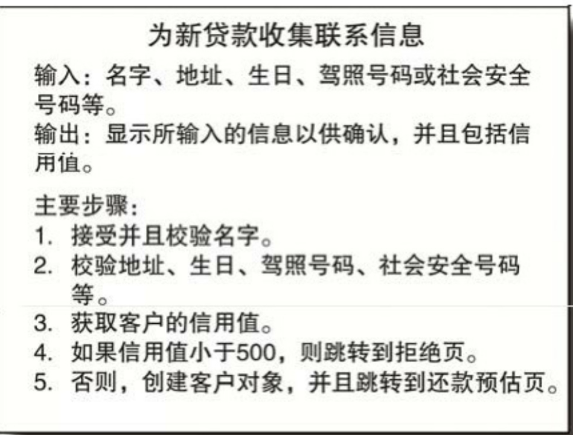
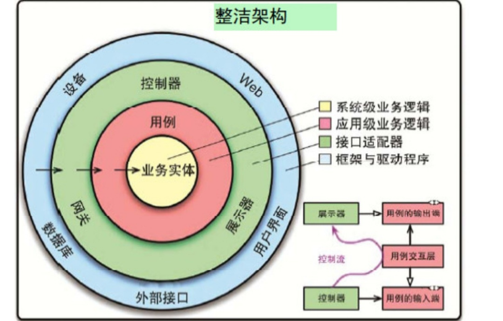

——

软件架构这项工作的实质就是规划如何将系统切分成组件（概念，数据结构和针对数据结构的操作的集合），并安排好组件之间的排列关系，以及组件之间互相通信的方式。

而设计软件架构的目的，就是为了在工作中更好地对这些组件进行研发、部署、运行以及维护。

如果想设计一个便于推进各项工作的系统，其策略就是要在设计中尽可能长时间地保留尽可能多的可选项。（易于变化？）（有更多的变化空间，免得足够没意料到的情况，发现无路可走）

上面这句话可能会让人很意外，也许你一直认为设计软件架构的目标应该是让一个系统能正确地工作。我们当然需要让系统正常工作，软件架构设计最高优先级的目标就是保持系统正常工作。

然而，一个软件系统的架构质量和该系统是否能正常工作的关系并不大，毕竟世界上有很多架构设计糟糕但是工作正常的软件系统。真正的麻烦往往并不会在我们运行软件的过程中出现，而是会出现在这个软件系统的开发、部署以及后续的补充开发中。

——

抽象概念和具体实现分离，降低抽象概念对具体实践的依赖程度，以保留切换具体实现的选择空间（比如用那种数据库）

——

接口比实现更稳定。

的确，优秀的软件设计师和架构师会花费很大精力来设计接口，以减少未来对其进行改动。毕竟争取在不修改接口的情况下为软件增加新的功能是软件设计的基础常识。

——

面向对象强调的是数据的封装和继承，

函数式编程强调的是函数（行为，算法）的封装和调用

程序就是数据结构和算法（再加上控制语句（顺序结构，分支结构，循环结构））

结构式编程追求把控制语句和程序隔离开？

——

我们先来看第一个支持目标：用例[插图]。我们认为一个系统的架构必须能支持其自身的设计意图。从用例的角度来看，架构师的目标是让系统结构支持其所需要的所有用例。

现在我们来想想所有的这些解耦动作对架构设计的第二个目标——系统（在服务器上）运行

我们进行架构设计的第三个目标是支持系统的开发。

——

解决方案，水平按UI，应用（业务含义，当前软件独有逻辑），领域（行业通用逻辑），数据库，水平分层

垂直，按业务用例，模块分层

应用层接口拆分：按使用场景（场景带来权限体系等）

——

譬如说，如果系统的业务逻辑与其UI无关，那么专注于UI开发的团队就不会对专注于业务逻辑开发的团队造成多大的影响。同样的，如果系统的各个用例之间相互隔离，那么专注于addOrder用例的团队就不太可能干扰到负责deleteOrder用例的团队。

只要系统按照其水平分层和用例进行了恰当的解耦，整个系统的架构就可以支持多团队开发，不管团队组织形式是分功能开发、分组件开发、分层开发，还是按照别的什么变量分工都可以。

——

通常，我会倾向于将系统的解耦推行到某种一旦有需要就可以随时转变为服务的程度即可，让整个程序尽量长时间地保持单体结构，以便给未来留下可选项。在这种方式下，系统最初的组件隔离措施都是做在源码层次上的，这样的解耦可能在整个项目的生命周期里已经足够了。然而，如果部署和开发方面有更高的需求出现，那么将某些组件解耦到部署单元层次就可能够了，起码能撑上一阵。

当然，随着系统在开发、部署、运行各方面所面临的问题持续增加，我们应该挑选一下可以将哪些可部署单元转化为服务，并且逐渐将系统向这个方向转变。

而随着时间的流逝，系统的运维需求可能又会降低。之前需要进行服务层次解耦的系统可能现在只需要进行部署层次或源码层次的解耦就够了。

一个设计良好的架构应该能允许一个系统从单体结构开始，以单一文件的形式部署，然后逐渐成长为一组相互独立的可部署单元，甚至是独立的服务或者微服务。最后还能随着情况的变化，允许系统逐渐回退到单体结构。

并且，一个设计良好的架构在上述过程中还应该能保护系统的大部分源码不受变更影响。对整个系统来说，解耦模式也应该是一个可选项。我们在进行大型部署时可以采用一种模式，而在进行小型部署时则可以采用另一种模式。

是的，要达到上述要求难度不小。我并没有说系统的部署模式就一定要是某种简单的配置项（虽然在某些情况下的确应该这样做）。这里的主要观点认为，一个系统所适用的解耦模式可能会随着时间而变化，优秀的架构师应该能预见这一点，并且做出相应的对策。

——

正如我们之前所说，架构师们所追求的目标是最大限度地降低构建和维护一个系统所需的人力资源。那么我们就需要了解一个系统最消耗人力资源的是什么？答案是系统中存在的耦合——尤其是那些过早做出的、不成熟的决策所导致的耦合。

——

“用例”的定义是描述特定场景下的业务逻辑。用例定义了用户所需的输入数据、预期的输出信息以及在产生输出后应采取的处理步骤。用例通常与API接口相关联，一个API接口可以包含多个用例。用例被视为低层概念，因为它们更靠近系统的输入和输出，直接反映用户的需求和操作。相对而言，业务实体则属于高层概念，它们是更加通用的逻辑结构，可以适用于多个用例，因而离系统的输入和输出更远

——

那么，怎样的决策会被认为是过早且不成熟的呢？答案是**那些决策与系统的业务需求（也就是用例）无关**。这部分决策包括我们要采用的框架、数据库、Web服务器、工具库、依赖注入等。在一个设计良好的系统架构中，这些细节性的决策都应该是辅助性的，可以被推迟的。一个设计良好的系统架构不应该依赖于这些细节，而应该尽可能地推迟这些细节性的决策，并致力于将这种推迟所产生的影响降到最低。

——

我们做的另一个早期决策是避免考虑数据库问题。我们当时确实考虑过使用MySQL，但最后还是故意采用了一种与数据库无关的设计，而延后了这方面的决策。这部分的设计也很简单，就是在所有数据访问逻辑与数据仓库之间增加一个接口。我们将数据访问方法放在一个名为WikiPage的接口中。这部分方法负责提供所需的查找、获取和保存页面的功能。当然，我们最初并没有具体实现这些方法，在开发不需要获取和保存数据的那部分功能时，我们只写了一个占位方法。

——

Ivar Jacobson关于软件架构设计的那本书：Object Oriented Software Engineering，请读者注意这本书的副标题：A Use Case Driven Approach（业务用例驱动的设计方式）。在这本书中，Jacobson提出了一个观点：**软件的系统架构应该为该系统的用例提供支持**。

——

以“用例”为核心测试，用例不应该依赖实现细节，用例就是单纯的有业务含义的高层业务逻辑，和数据库，消息队列等实现细节无关，测试也是针对用例做测试

——

我们测试的应该只是一个简单的业务实体对象，没有任何与框架、数据库相关的依赖关系。总而言之，我们应该通过用例对象来调度业务实体对象，确保所有的测试都不需要依赖框架。

——

用例中包含了对如何调用业务实体中的关键业务逻辑的定义。简而言之，用例控制着业务实体之间的交互方式。

——

业务实体

业务实体实际上就是计算机系统中的一种对象，这种对象中包含了一系列用于操作关键数据的业务逻辑。这些实体对象要么直接包含关键业务数据，要么可以很容易地访问这些数据。业务实体的接口层则是由那些实现关键业务逻辑、操作关键业务数据的函数组成的。

——

用例本质上就是关于如何操作一个自动化系统的描述，它定义了用户需要提供的输入数据、用户应该得到的输出信息以及产生输出所应该采取的处理步骤。当然，用例所描述的是某种特定应用情景下的业务逻辑，它并非业务实体中所包含的关键业务逻辑。

——

用例示范

 

——

用例设计就是要从prd中，抽离出抽象步骤，以及步骤具体要做的事情，并把业务步骤设置为业务数据的行为

——

DTO转换为BO应该放在接口层

BO转换为DAO应该放在存储层

因为BO是核心，BO不应该依赖DTO和DAO，实体也一样，谁更容易变更，谁就要减少对自己的依赖，更多的把依赖关系转换为自己依赖别人（支撑依赖核心）

——

可被测试：这些系统的业务逻辑可以脱离UI、数据库、Web服务以及其他的外部元素来进行测试。

——

 

——

所谓关注点分离，就是不要一次性处理多件事情，每个方法（每段代码）只关注一件事，尤其是业务逻辑和实现逻辑要分离。

而切面，分层，设计模式，框架，很多时候就是在提供实现关注点分离的通用思路和开箱即用的工具。

——

架构设计的任务就是找到高层策略与低层细节之间的架构边界，同时保证这些边界遵守依赖关系规则。所谓的服务本身只是一种比函数调用方式成本稍高的，分割应用程序行为的一种形式，与系统架构无关。

——

我们在系统设计与测试设计时，应该让业务逻辑不通过GUI也可以被测试。

——

但性能怎么办呢

性能难道不是系统架构的一个考量标准吗？当然是——但当问题涉及数据存储时，这方面的操作通常是被封装起来，隔离在业务逻辑之外的。也就是说，我们确实需要从数据存储中快速地存取数据，但这终究只是一个底层实现问题。我们完全可以在数据访问这一较低的层面上解决这个问题，而不需要让它与系统架构相关联。

排除掉类似循环里查数据库等错误的编码实践，性能优化，更多时候还得靠修改业务实现的方式来实现，比如冷热数据分离等

——

系统架构设计中的第一步，是识别系统中的各种角色和用例。

——

如你所见，图中显然存在着四个角色。根据单一职责原则(SRP)，这四个角色将成为系统变更的主要驱动力。每当添加新功能，或者修改现有功能时，我们所做的一切都是在为这些角色服务。所以我们希望能够对系统进行分区处理，避免其中一个角色的变更需求影响其他角色。

——

复杂性，不可见性，易变性，兼容性

轻流以高度的抽象，有效缓解了软件不可见性的问题

轻流以低门槛，降低了软件开发的复杂性

轻流天然支持易变性，云平台解决了软件的兼容性问题

核心最重要的，是业务逻辑，和搭建架构，具体搭建的实现人员，可以低成本替换

——

很多不必要的流程和解决方案，是因为工具的受限

——

内存也只是一种存储介质，有地址，有物理存在，没有那么随机

——

在真正制作出来一个可复用框架之前，是不知道怎么制作一个可复用框架的。想要制作一个可复用的框架，必须要和几个复用该框架的应用一起开发。

至少要一次性开发3个？

——

每一层，都有当前层的数据结构，和下一层的数据结构的双向转换，只有domain层没有转换，只接收和返回entity

