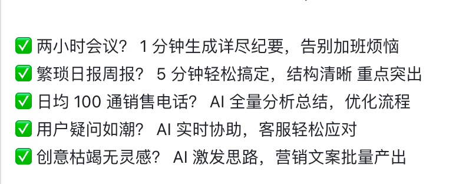

创意生成，根据需求，生成大量可能的解
人类的工作从根据需求求解，变成了从大量的可能解中，排查最优解

——

生成待选解的工作转移到了AI工具身上

——

——

汇总西游记中，孙悟空相关的章节，以角色为主线，讲述不同视角的西游记

根据情节，生成图片，让读者更好的理解西游记

生成视频，更形象的感受西游记

——

提炼关键概念，解释概念，关键概念间的相关性

通读课文，把课文串起来读

——

“我们希望构建的，是一个包含AI Agent（智能座席）、AI Copilot（智能辅助）、AI Insight（智能洞察）三位一体的AI引擎，恰巧对应了智能客服、知识中心和数据分析这3个最核心的生成式AI应用场景。”

在谈到智齿科技上一个版本的AIGC文本机器人时，陈喆表示，在产品团队走访调研过十余家应用、测试过AIGC的客户后，发现一个核心诉求：大家希望不仅在线文本机器人，语音、邮件类机器人都可以应用AIGC，这对于过往的产品结构而言绝非易事。

“这绝对是一次‘碎骨重塑’！”陈喆感慨道，“过往因为不同机器人产品的应用场景、使用对象不同，每一类机器人会有自己的专属知识库。但我们要打造的AI Agent，是一个完全独立的、懂企业业务的个体，它只有掌握这家企业的所有知识+流程，才能独立应对各种业务场景。因此，我们把产品线各自的专属知识库抽离了出来，搭建了独立运营的知识中心+任务流程中心。”

陈喆不断强调，只要机器人掌握了**知识+任务流程**这两件事，就相当于它懂了这家公司的业务。因此AI Agent不是“某一类”机器人的概念，而是一个类似真人的独立个体，可以同时操控所有机器人（如文本、呼入、外呼、邮件机器人）的能力，它就如同一个真实的一线接待多面手，能够处理各类业务问题。

“大模型能力直接赋能于知识中心，企业可以将自己所有的业务材料统一上传，企业自有问答库也在其中统一运营。在配置AI Agent时，可以根据Agent的任务方向勾选对应的知识，让Agent更聚焦。这样，无论客户从哪个渠道来，Agent都能够直接接待，并根据客户的需求触发对应的业务流程，独立解决率将大幅度提升。”

在过去的三四年间，智齿科技的产品发展大原则之一，是如何为客户的全球业务，做最好的客户联络应用。多语言、多时区、多海外渠道、多区域合规、数据安全……每一项看似“基础”的应用，背后都是出海企业最硬核的诉求。“我们坚信‘发展以致用’，任何技术都应该以可用、有用、好用为前提，这也是当生成式AI技术的热潮来临时，我们一直把很大资源投入在‘应用层’建设上的原因。产品是否好用，一试便知。”陈喆补充道。

**他的核心观点是，认为 LLM 正在从主要优化消费级问答体验，转向优化支持智能体工作流（如工具使用、计算机操作、多智能体协作等）。**
模型优化正向着适配智能体工作流发展
在此之前的阶段，各大厂训练优化大语言模型的主要目标是回答好问题。

但是，随着AI应用的不断扩展，这些模型逐渐调整、升级以适应代理任务的工作流程，而这一趋势正在显著提升模型代理任务的性能和多功能性。
此前，大语言模型的训练过程通常采用经过指令调整的数据集，以帮助模型生成更具针对性和实用性的回答，满足用户在面向消费者的大语言模型中的问题和需求。
而现在，AI代理的应用场景对模型的行为提出了更高的要求！

**在代理任务中，模型通常需要在迭代工作流程中执行更复杂的任务，如自我反思和优化输出、使用工具辅助决策、制定详细计划，甚至在多代理环境中协作以完成目标任务。**

**工具调用是AI代理中一个关键功能。**

——

