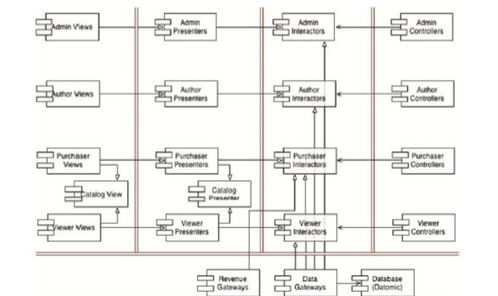

# 如何设计软件架构之我见

架构设计第一问，谁是主角（变更的主要驱动因素），以什么视角叙事（谁是用户？为谁服务？谁来决定买单？（往往是复杂的，但是总得有个主次））

主角代表变更的主要驱动因素

架构设计的视角选择，大部分时候总是以人（角色）的视角叙事、设计，因为变更主要是因为人（角色）的驱动，人是系统的主角，推动剧情（系统功能）的发展。

同时结合事的视角，有些事虽然是不同的人在做，但是是同一件事

以什么视角为主，取决于系统的主角是谁，即推动剧情发展的是谁，是人就选择人为主视角，是事就选择事为主视角，同时可能不同的模块有不同的主角，要切换视角。

另外为了应对变更频率的问题，有了分层，把不同变更频率的事情分到不同层次，同时调整依赖关系，避免变更扩散

——

这两个维度（角色，依赖层次）的隔离都是为了将不同变更原因和不同变更速率的组件分隔开来。譬如变更的原因不同是因为组件使用的角色不同，而变更速率则取决于组件所在的层级。

——

以每个角色为中心，设定一个组件，每个角色组件包含这个角色的视图，展示器，交互器，控制器（贯穿层次）

同时补充一些以事为视角叙事的通用接口

 

——

轻流感觉更多的是以功能为视角，而不是以搭建者这类角色为视角去设计

——

置身于高度抽象的框架之上，更难获取这个框架为什么这么设计的原因，就像从开始就用编程框架编码的程序员，其实更难理解编程理念，因为大部分情况下都能用，不能用的情况也死不了人，所以也不会再去花心思花精力去研究如何突破这套框架，也就不会花心思去思考这套框架的本质。

这个社会和文化也是一样，人从出生开始，就已经一套设计好的框架中，且这套框架经过数千年的验证，足够好用，按照这套框架生活，很少会遇到困惑，也就不会花心思去突破这套文化框架，也就不会花心思去思考文化的本质，同时突破框架要和所有认同这套框架的人作斗争，改变他们的观念，不论是编程框架还是社会框架都是如此，往往只有高位者才有这样的能力，而高位者之所以做到高位，很大程度上是因为他能在这套框架下做的很好，需要一个在这个框架下做的很好的人去反对这套框架本身会更加困难。这也能解释为什么真正的社会变革往往来自低位者，高位者带来的往往是改良。低位者的改革，需要矛盾的堆积，感到不舒服的人的力量的总和足够大了，就会爆发出足够大的社会变革，创建符合新力量利益诉求的新框架。

如果想要了解编程的本质，编写出更能应对变化，易维护性，高性能，更丰富的功能，得从编程的历史，编程会遇到的问题（在不同的软硬件环境下，实现相同的功能，在不同的社会文化和生产力的环境下，满足相同的需求；功能要更丰富的功能性，更专，更广，更新鲜的体验，更简便的操作方式，人的需求的满足同样也是有这样的螺旋上升）的实践中总结经验，并上升到原则和哲学，即认识论和适合自己的框架一样，如果想要了解人的本质，在更好的满足自己需求的目标下，过好自己的一生，也要从人的历史包括生物的历史，和人的生活中总结实践经验，并上升到原则和哲学，并形成自己的认识论和适合自己的框架以及框架的实现细节，才能在不断变化的自身和社会环境下，确保自己应对变化的能力，以及正确应对变化的能力。

——

类比简洁架构，人的框架也需要识别自己的驱动因素，自己的叙事视角，这个视角必要要以自己为主，即自己想做的事情，自己的需求，自己的需求，驱动自己的变化，抽象自己不同的角色，为每个角色构建一套组件，一套知识和技能体系，同时给知识和技能分层，把需求逻辑层次的知识和技能，具体实现层次的知识和技能隔离开，因为人也是在不同的具体实现上，实现相同的本能需求。

同时抽象出不同角色下，相同的事情，以事的视角去构建这部分事情的知识体系。

最终目前看起来最好的实现方式，还是类似器道之分一样，区分自己的领域层和自己的具体实现层。

最后，但是最重要的是，这套系统不是为了搭建而搭建，而是要满足人的需求而建立，这个需求，最主要最核心的就是自己的需求，同时因为人的社会性本能，“我”的需求往往和满足“抽象的社会”的需求绑定，无偿的需求满足是为了意义，有偿的需求满足是为了自己的生存，但是无偿劳动，虽成无荣，即使真的为了意义而满足的需求，这个需求的满足最好也需要收取报酬，这个报酬的收取是为了意义，而不是为了报酬本身，利益和感情，一种是索取，一种是付出，轻易不要混淆这两者，就如同，酒肉穿肠过，佛祖心中坐，他人所学我，如同堕魔道。没有足够的自己的内核压仓，君子慎独。

当剥离了所有的服务他人的角色之后，最后剩下的那个“我”的需求是什么？还剩多少？

目前就是创作，这部分的需求，即使收钱，也不是为了利益收钱，而是为了实现自己的意义而收钱。