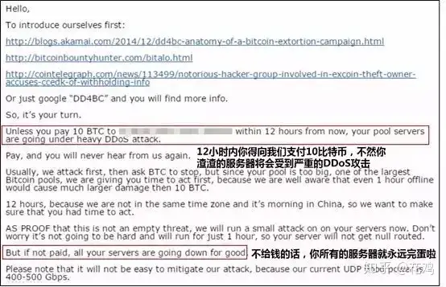

# 阿里云网红|写“道哥的黑板报”的“文艺网红”

吴翰清，这个资深黑客拥有诸多身份：

写“道哥的黑板报”的“文艺网红”

阿里云云盾的负责人

在他心里，第一个身份轻如鸿毛，第二个身份重若泰山。
保卫阿里云这个中国 35% 的网站都坐落其上的云计算平台和上面的居民，道哥觉得自己守土有责，不容有失。

探底黑产，描绘自己的作战地图，是他对自己职责要求的一部分。

他告诉雷锋网一个秘诀：“想要知道中国的黑产有哪些行业，只要看淘宝的禁限售板块就够了。”DDoS攻击，敲诈勒索，暗网黑市，这些黑色产业，往往最终都会涉及到对阿里云上服务器的攻击。

站在他的角度看，这个世界充满血雨腥风。

**险恶的世界**

**DDoS**
我们定义一个大的流量攻击，一般是300G以上。实际上根据我们掌握的信息，国内已经有组织可以打出一个T 的 DDoS 攻击。而且，其中80%都是由同一个组织打出来的。这些组织的实际控制人大多都潜逃在国外。

驱动这些攻击的原因非常简单：钱。有人买就有人卖。道哥告诉雷锋网，如今打出 10G 流量攻击，只需要几百块钱。

DDoS 攻击这个行业，最为经典的玩法是攻击游戏私服。由于私服本身具有违法性质，所以并不敢求助于警察，黑吃黑是行业的通则。2013年中国国家顶级域名“.cn”的根域名曾经被打摊，这件轰动一时的事件就是因为黑产攻击误伤了底层服务器。

掌握巨大带宽资源的黑客组织两边赚钱，一边收人钱财替人攻击，一边敲诈被攻击者谋取更高利益。他们甚至勾结 IDC 机房，花钱买下机房所有的闲置带宽，生意规模超出一般人的想象。

**敲诈**

很不幸，所有拿热钱的行业，都会被黑客盯上。P2P和互联网金融就是本轮中枪的行业。

因为金融行业信誉非常重要，如果服务宕机，就很有可能丧失用户的信任，从而遭受挤兑，这可能会导致破产。这些都是黑客勒索的绝佳条件。

道哥讲了黑产的两种玩法：

1、入侵 P2P 公司的服务器，盗取用户的信息。把这些高价值的客户信息出售，由下家进行广告和黑色推广。

2、威胁 DDoS 攻击，敲诈勒索。如果妥协掏钱，过一段时间对方往往还会回来继续勒索。

搞清黑客的目的，对于防御至关重要。“根据判断，下一个被黑产盯上的行业很有可能是直播行业。从现在的情况来看，这件事情已经发生了。”他说。

某英文 DDoS 敲诈信

**云上的攻防**

**云是解药**

作为云计算的信徒，道哥相信这种正在迅速攻城略地的计算变革，从某种程度上来说是安全的解药。他举了一个例子：

我曾经到某监管单位参观 。在巨大的屏幕上，他们能够实时监控各个系统有没有出现漏洞。但是，他们看到了却无法非常迅速的修复。因为它对应的1000多个业务主体，各自的系统模式都是不一样的 。

但是如果使用云计算作为基础，就可以统一 Iaas 层，在很短的时间里修复漏洞 。

今年上半年，云盾为云上的几万个客户共修复了46万个漏洞。这个成绩让道哥颇为骄傲，他说在以前这不可想象。

**现实残酷**

纵然背靠阿里云，在和黑产的对抗中，防守一方也并不占优势。他说：

很遗憾，攻击者仍然走在前面。因为我我们还不能预测黑客下一步的动向。

这直接导致了安全产品必须被动地等待攻击发生，才可以采取“救火”行动。对于云盾来说，从黑客暴露攻击意图，到攻击被封堵，仍然有12个小时的周期。

黑产控制的互联网攻击如同疫情一样，大多数情况下，被感染的主机都会继续向周围传播恶意代码。而面对以“光速”传播的病毒，每一秒都至关重要。

2015年12月，有数千个客户的云服务器对外疯狂发包。云盾紧急通知客户并协助处置，发现黑客正在使用了一个弱口令漏洞传播恶意代码。“幸亏这个漏洞在12个小时之内被修复，如果响应时间是24或48小时，就会造成更大的损失。”他说。

**优质的标准品**

如果把互联网的攻防简化到一张地图上，你可以看到无数漂浮于云上的节点，黑产和安全人员拼尽全力争夺这些节点。

在如瘟疫一般扩散的恶意代码眼里，没有大企业和小企业，只有能够攻下的服务器和不能攻下的服务器。

现在几乎所有的安全公司都在服务顶端 3% 的大客户，因为他们有充足的资源雇佣各种特种兵。但是很多并没有很多安全预算的中小企业的死活却没人关心。

道哥觉得，云盾应该为中小企业提供安全感。实际上物美价廉的解决方案只有一种，那就是不需要耗费过多人工成本的软件服务平台（SaaS），所谓优质的标准品。

接下来的问题就变成了：怎样才能做出这样的一个平台。

**数据和计算**

**把机器训练成安全专家**

一个优秀的安全人员，可以通过分析网络日志，找出服务器被进攻的蛛丝马迹，在黑产攻防版图上拔掉敌人的一个据点。

但是对于道哥的云盾来说，它面对着数以十万计的云服务器，人工排查根本不是他的选项之一。如何把机器训练成为安全专家才是解题方法。

一支火箭想要上天，其核心要素有两个：发动机和燃料。机器学习很像一枚火箭，它的燃料是巨大的数据量，它的发动机是强大的计算能力。

对于阿里云云盾来说，每天的增量数据是 300T，来自于阿里云客户授权的全量数据。而计算资源，本身就是阿里云的巨大优势。

结果是，云盾通过纯系统计算的方式，可以感知到80%的入侵。道哥说，这个指标是同类系统的三倍。

**孰优孰劣**

这个检出率在某种程度上和人工检查不相上下，道哥给出了一个场景：

如果一个客户上传了一个 Webshell，如果安全专家分析全量的数据，可能要一周时间，现实情况中，往往不会这样做。他们往往根据经验，而不是完整的证据链条来判断入侵。这种情况下就会出现失误。而对于机器来说，它会分析全量数据，呈现出完整的证据链条。这样的结果更加精准。

在成本和量级上，云盾和人工没有可比性。客观来讲，道哥在做的事情，离开阿里云很难复现。

云盾的大数据中，可以做出很多的关联分析，例如：两次攻击事件之间的关系，一个黑产组织在盯着哪些服务器等等。

如果说由各路黑客大神领军的安全实验室是特种兵的话，云盾更像是一支常备部队，保卫阿里云安全的基本态势。

道哥自信地对雷锋网说，云盾面前并没有明显的技术困难。但是，有很多攻击获取到的数据维度较为单一，在这种情况下，可用数据可能仅仅是一个 IP 的行为，在有限的数据下，如何利用计算能力更深层次的挖掘出攻击相关信息，就成为了一个重点。

**代表我的伟大作品**

说来，很多人认识道哥，是因为喜欢他写的“黑板报”。

道哥的黑板报”最早确实给我带来了一些声望。但我不是个作家。我希望的是做出一个好产品，让产品代表我。

道哥如此解释荒废了自己在黑客界“估值颇高”的公众号的原因。但是，这位黑客并不是生来就如此“任性”。

他为雷锋网讲了一段阿里云掌门人王坚的往事。

当时所有人都谣传王坚博士要离开。

“糟糕”，是对阿里云最初两年业绩最广泛的评价。作为阿里云的掌门人，王坚目睹兄弟部门已经磨刀霍霍，单等阿里云解散之后，瓜分兵马粮草。

纵然相信云计算未来一定会崛起，但是在遥遥无期的漫长等待面前，道哥终于扛不住，辞职了。出乎意料，王坚却没走。

他说他数次被逼到死角，退无可退，但是他真的没走。他不仅一直坚信云计算大有前途，还在一直不断地投入自己的一切。马云不懂云计算，但是最终他选择相信博士这个人。

王坚的路上终于出现了第一个路标。阿里云用五千台计算机连接成一个巨大的服务器，这就是5K项目。这个技术创举一举奠定了阿里云后来的江湖地位。

“王坚博士颠覆了我的世界观”，道哥说，“当他邀请我回到阿里云的时候，我真正感觉到，这件事能成。”这种宗教般的使命感，让道哥根本不在意他的“黑板报”，一腔热血死磕云盾，才有了如上的全部对话。

回到这种使命感本身，该坚持坚持，该放弃放弃。做出选择很简单。

雷锋网问道哥：“这个能代表你的产品就是阿里云云盾吗？”

道哥答：“我希望是。”