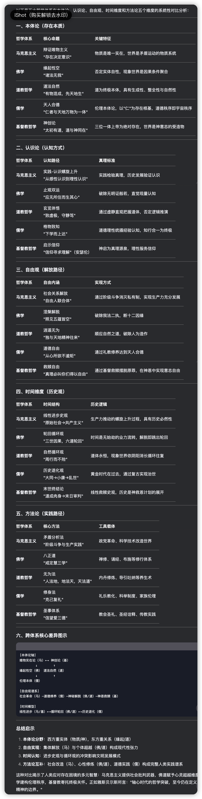

从本体论、认识论、自由观、时间维度和方法论五个哲学维度，对佛学、道教哲学、儒学、新儒学、基督教哲学、印度教哲学、伊斯兰教哲学、马克思主义哲学与其中国化形态进行系统性对比分析

——

首先，我需要明确马克思主义哲学的基本观点，以及中国化后的调整，比如毛泽东思想、邓小平理论等。用户可能希望了解两者在不同哲学维度上的异同，尤其是在中国实践中如何发展马克思主义。

本体论方面，马克思主义强调物质第一性，而**中国化可能更强调实践的作用**。比如毛泽东的《实践论》突出实践的重要性，可能在本体论上结合了物质和实践的关系。

认识论方面，**马克思主义的认识论是能动的反映论，强调实践到认识到再实践**。中国化的版本可能**更注重理论与实践的结合，比如“实事求是”原则，邓小平的“摸着石头过河”也体现了这一点。**

**自由观**方面，马克思主义认为**自由是对必然的认识和世界的改造(人是社会关系的总和，所以人的自由是社会关系的解放)**，而**中国化可能更强调集体自由和逐步实**现，比如共同富裕和社会主义初级阶段的理论。

时间维度上，马克思主义是线性的历史唯物主义，而中国化可能引入更灵活的阶段论，如社会主义初级阶段和长期处于此阶段的判断。

方法论方面，唯物辩证法是核心，中国化可能加入了矛盾分析法，如主要矛盾和次要矛盾的区分，以及“两点论”和“重点论”的结合。

---

以下从本体论、认识论、自由观、时间维度和方法论五个哲学维度，对马克思主义哲学与其中国化形态进行系统性对比分析，并结合具体理论与中国实践案例展开说明：

------

### **一、本体论对比**

#### **1. 马克思主义哲学**

- **核心主张**：
  坚持**辩证唯物主义**，强调物质是世界的本原（“世界的统一性在于物质性”），意识是物质高度发展的产物，社会存在决定社会意识。
- **经典表述**：
  《德意志意识形态》中提出“不是意识决定生活，而是生活决定意识”，《资本论》通过商品二重性揭示物质生产关系的客观性。
- **实践指向**：
  通过改变物质生产关系实现社会变革（如推翻资本主义私有制）。

#### **2. 中国化马克思主义哲学**

- **核心创新**：
  在坚持物质第一性基础上，提出**“实践本体论”**，突出实践对主客（tiger:物质和意识）体关系的统摄作用（毛泽东《实践论》：“实践的观点是辩证唯物论的认识论之第一的和基本的观点”）。
- 典型发展：
  - 邓小平“社会主义初级阶段论”立足中国物质生产力实际，否定“唯生产关系论”；
  - 习近平“新发展理念”强调“绿水青山就是金山银山”，重构人与自然物质关系的认知。
- **实践指向**：
  “实事求是”原则（从延安整风到改革开放）成为改造中国社会的根本方法论。

------

### **二、认识论对比**

#### **1. 马克思主义哲学**

- **核心逻辑**：
  强调**能动的革命的反映论**，认为认识是“实践—认识—再实践”的螺旋上升过程，真理具有客观性与具体性（列宁：“真理是过程”）。
- **经典案例**：
  《资本论》通过分析商品流通规律揭示剩余价值本质，体现从现象到本质的认识深化。

#### **2. 中国化马克思主义哲学**

- **核心创新**：
  提出**“知行统一论”**，将认识论与群众路线结合（毛泽东：“从群众中来，到群众中去”），并发展出“摸着石头过河”（渐进改革）与“顶层设计”（系统思维）的辩证统一。
- 典型发展：
  - 邓小平“猫论”（“不管黑猫白猫，捉到老鼠就是好猫”）体现实践标准优先的认识论突破；
  - 新时代“问题导向”思维（如脱贫攻坚“精准识别—精准施策—精准退出”方法论）。
- **实践突破**：
  社会主义市场经济理论打破“计划与市场对立”的教条认知，实现认识论革命。

------

### **三、自由观对比**

#### **1. 马克思主义哲学**

- **核心定义**：
  自由是“对必然的认识和对客观世界的改造”（恩格斯），终极目标是实现“每个人的自由发展是一切人自由发展的条件”（《共产党宣言》）。
- **实现路径**：
  通过消灭阶级和私有制，建立共产主义社会，摆脱异化劳动对人的束缚。

#### **2. 中国化马克思主义哲学**

- **核心创新**：
  提出**“集体自由优先于个体自由”**（如“先富带动后富”），强调自由实现的阶段性（邓小平：“社会主义初级阶段需要上百年”）。
- 典型发展：
  - 毛泽东“为人民服务”思想将个人自由纳入集体解放框架；
  - 习近平“人类命运共同体”理念将自由观扩展到全球治理维度。
- **实践特征**：
  “脱贫攻坚战”中通过制度性保障实现9,600万人口“免于贫困的自由”，体现社会主义自由观的实践特质。

------

### **四、时间维度对比**

#### **1. 马克思主义哲学**

- **时间观特征**：
  强调**线性进步史观**，以生产力与生产关系矛盾运动为动力，划分原始社会—奴隶社会—封建社会—资本主义社会—共产主义社会五大形态。
- **革命策略**：
  主张通过暴力革命实现社会形态的断裂式跨越（如巴黎公社、十月革命）。

#### **2. 中国化马克思主义哲学**

- 核心创新：

  提出**“社会形态弹性论”**：

  - 毛泽东提出新民主主义社会作为过渡阶段；
  - 邓小平确立“社会主义初级阶段”长期性判断（至少持续到21世纪中叶）；
  - 新时代“两个阶段”战略（2020-2035年基本实现现代化，2035-2050年建成现代化强国）。

- **实践突破**：
  “一国两制”构想（资本主义香港与社会主义大陆并存）打破社会形态更替的机械时间观。

------

### **五、方法论对比**

#### **1. 马克思主义哲学**

- **核心方法**：
  **唯物辩证法**（对立统一、质量互变、否定之否定三大规律），强调矛盾普遍性与特殊性（列宁：“具体问题具体分析是马克思主义活的灵魂”）。
- **经典运用**：
  《资本论》通过分析商品内在矛盾（使用价值与价值）揭示资本主义危机必然性。

#### **2. 中国化马克思主义哲学**

- 核心创新：

  发展出**“矛盾分析法中国范式”**：

  - 毛泽东《矛盾论》提出“主要矛盾决定论”（如新时代“人民日益增长的美好生活需要和不平衡不充分的发展之间的矛盾”）；
  - 邓小平“两手抓”方法论（物质文明与精神文明、改革与稳定等）；
  - **习近平“两点论与重点论统一”（如“既要金山银山，又要绿水青山；宁要绿水青山，不要金山银山”）。**

- **实践突破**：
  “渐进式改革”路径（价格双轨制、经济特区试验）体现量变到质变的中国智慧。

------

### **总结：理论创新图谱**

| **哲学维度** | **马克思主义哲学** |                   **中国化马克思主义哲学**                   |         **创新实质**         |
| :----------: | :----------------: | :----------------------------------------------------------: | :--------------------------: |
|  **本体论**  |     物质本体论     | 实践统摄下的物质本体论 tiger: 实践和事的双重本体论，实事求是 | 强化实践对物质运动的能动作用 |
|  **认识论**  |    能动的反映论    |              群众路线与渐进改革结合的知行统一论              |  认识论与治国理政方法论融合  |
|  **自由观**  | 阶级解放导向的自由 |                 集体自由优先的阶段性自由实现                 |   自由实现路径的本土化重构   |
| **时间维度** |  线性社会形态更替  |                        弹性发展阶段论                        |    打破教条主义历史阶段论    |
|  **方法论**  |  唯物辩证法三规律  |                   主要矛盾分析法与“两点论”                   |    矛盾学说的战略运用升级    |

tiger:看起来是，当国家越来越大，成分越来越复杂，实际情况的量变引发了哲学观点的质变。

------

### **深层理论启示**

1. **本体论突破**：中国化马克思主义通过“实践”范畴，弥合了西方马克思主义“物质—意识”二元对立困境（如卢卡奇“总体性”与中国“实事求是”的暗合）。
2. **认识论跃迁**：将“实践标准”发展为“三个有利于标准”（**是否有利于发展生产力、增强综合国力、提高人民生活水平**），实现**真理标准向价值标准的延伸。**
3. **文明对话意义**：中国化马克思主义的方法论（如“和而不同”）为破解“历史终结论”提供了非西方现代性方案，其时间观的弹性特征更契合复杂性科学思维。

这一对比不仅展现马克思主义哲学在中国的创造性转化，更揭示了哲学理论在回应“中国之问、时代之问、人民之问”过程中的实践生命力。

-----

