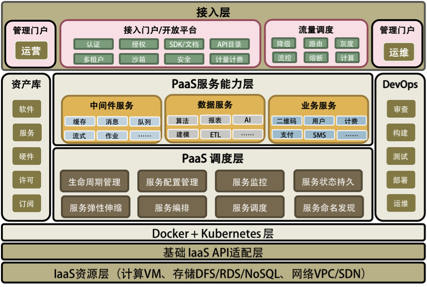
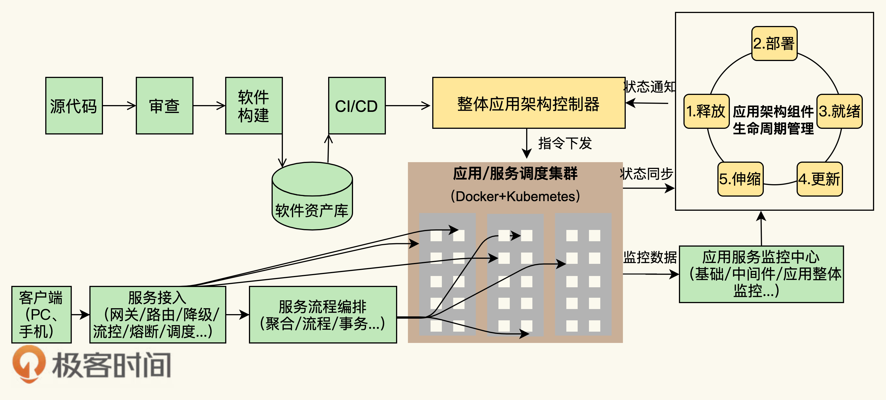

# 一个公司的“工业化体系”具体是什么？应该怎么建设？

**paas平台总体架构**

## 分布式和微服务

分布式部署和微服务是有相关性的两个东西

> 微服务：
>
> 简单理解就是将功能模块的多个功能，拆分为多个小功能服务，具体拆分多细的颗粒度，取决于需求项目需要，在服务之间可以通过RPC或其它方式来相互交互。
>
> 
>
> 分布式：
>
> 分布式简单理解就是将服务分散部署在不同的服务器上，服务与服务之间的调用也是通过RPC或其它方式来交互
>
> 
>
> 关系：
>
> 微服务在生产环境下大部分是通过分布式部署的，但是分布式部署的应用不一定是微服务架构的，比如集群部署，它是把相同应用复制到不同服务器上，但是逻辑功能上还是单体应用
>
> 
>
> 区别：
>
> 1、微服务指的是将应用模块拆分成细颗粒度的手段，为了达到降低开发成本，以及达到松耦合的目的。
>
>  2、分布式其实可以理解成一种部署方式，将服务分别部署在不同的服务器上达到高并发，高可用的目的。

轻流可以理解为是分布式的集群部署（单体应用复制），但还不是微服务。

微服务是为了松耦合、降低开发成本；

分布式是为了线上环境高并发、高可用。

## 工业化体系：

- 抽象建模、简化、标准化、自动化、规模化，整个流程就是“工业化体系”
- 发布自动化
- devOps
  - devOps是合的手段，合的手段是解决分产生的问题，比如分布式部署和开发
  - 全栈开发也一样是合的手段，同样是解决分产生的问题，比如前后运维测试的分工
- 国际化预研
- 左耳听风
- 基建：模块化、RPC、网关、消息、全文检索、定时器、日志、监控、自动化、数据、数据库、计费
- 解决方案
- 把运维考虑到服务端来
- 猛哥：表单流程
- 杜伟：数据
- 老王：软件基座 & 大客户

## Q3公共技术组的目标

- P0: 架构师的基建需求
- P0: 数据平台的预研
  - 所谓的【大数据】：业务数据分析平台
- P1: 为后端稳定版封装和后端发布的部分自动化和未来的规模化做预研支撑（目前进度是还在抽象化和简化阶段，还未完成标准化）
- P2: 服务治理的准备工作：
  - 梳理现在的服务（各种功能的分布）的分布、重要性、依赖关系
  - 监控：基础、中间件、应用
    - 链路追踪和服务注册、发现
      - skywalking、nacos
    - 硬件级别的监控和消息队列情况的监控
      - 普罗米修斯
    - k8s
    - 工作流引擎：把若干服务编排起来形成一个业务流程
      - 面向变更设计

> 我们对应的是产业化资本化的农业，而产业化资本化，内在道理是一样的，为什么要搞大规模农业呢，还必须标准化，要用同一个品种，去掉了农业本身的物种多样性，要什么样的品种呢，一定是那个产量最高的。那品质呢，各个品种具有不同的品质，不同的自然适应性，所有这些东西，不在它的考虑范围内。产业化农业是单一化的，规模化的，集约化的，去多样性的，本质上不符合生态文明的要求。
> 各个品种具有不同的品质，不同的自然适应性，所有这些东西，不在它的考虑范围内。产业化农业是单一化的，规模化的，集约化的，去多样性的，本质上不符合生态文明的要求。

——
标准化和规模化是产业资本阶段的要求，必然导致单一化&产业化的趋势，标准化/自动化/规模化的，一定是那个效率最高的模型，也一定会导致把人异化为劳动力。
下一个阶段应该考虑的是可持续，可持续的关键在于创新和人才，这些的基础是多样性，需要反标准化。（这是不是和所谓的第二曲线是类似的？）因为单一产业本身会有规律性的曲线，即周期，所以破解周期性的低谷危机（还有规模化之后的改动成本问题），需要多样性，用多条曲线抵消单一曲线的周期性危机？
产业化会导致不可持续（周期性危机）但是发展阶段本身不能跳过，只是得知道为什么要产业化（标准化）以及产业化的下一步应该是多样化（第N曲线）
产业资本的下一个阶段是金融资本，即虚拟化，空心化？

## 软件工程能力

- 第一，提高服务的 SLA
  - 高可用的系统；
    - https://coolshell.cn/articles/17459.html
  - 自动化的运维。
    - 因为故障是常态，如果没有自动化的故障恢复，就很难提高服务的 SLA

- 第二，能力和资源重用或复用。
	- 软件模块的重用；
	- 软件运行环境和资源的重用。
		- 一个是“软件抽象的能力”
		- 另一个是“软件标准化的能力”
			- 你可以认为软件抽象就是找出通用的软件模块或服务，软件标准化就是使用统一的软件通讯协议、统一的开发和运维管理方法……这样能让整体软件开发运维的能力和资源得到最大程度的复用，从而增加效率。
- 第三，过程的自动化。
	- 软件生产流水线；
	- 软件运维自动化。
	  - 我们除了需要 CI/CD 的 DevOps 式的自动化之外，也需要能够对正在运行的生产环境中的软件进行自动化运维。

对应：

- 分布式多层的系统架构。
- 服务化的能力供应。
- 自动化的运维能力。

