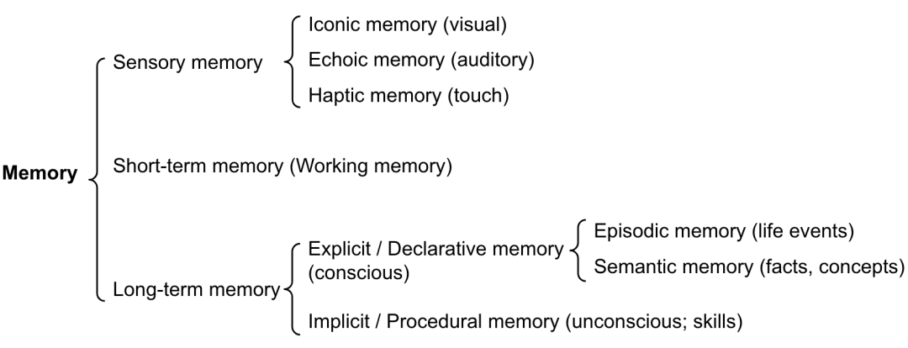

# 梳理

能《生存》然后《修行》；

《修行》得到《哲学》，《哲学》指导《修行》；

《生存》需要《技能》、《管理》和《人情世故》

更好的《生存》需要《哲学》的指导

人类的常态是权力制衡？——中国是一个大一统的国家，民族、时间、空间等物质的不同，导致精神的不同，这种不同在现阶段过于普遍，以至于现阶段很难达到全世界的大一统，还是需要绝对价值的提升。

### 观点

——

绝对价值和相对价值的优先级的先后判断，取决于目标的不同，如果目标是整个人类整个地球的地位，那么就会追求绝对价值，如果目标是地球内单个种族的短期地位，那就会追求相对价值。

——

架构方法论的演变，主要也是因为规模的演变，从单业务单页面，到单业务多页面，再拆分业务模块，再到多业务、多领域，规模的量变和质变，带来了对架构（组织工具）演变方法论的需求的量变和质变。

——

康威定理认为，产品必然是其（人员）组织沟通结构的缩影。

——

自动化测试不是为了测试新的功能，而是保证添加新代码的时候已有的功能不被破坏，也就是回归测试。

——

单元测试也会倒逼开发去设计更加抽象和优雅的接口，让代码质量和可复用性更高。

——

自动化测试是 CI/CD 的前提条件，整个 pipeline 要像无人值守的流水线一样有节奏的跑起来，像地铁时刻那样精准，才可能实现 CI/CD。一旦其中一个环节要人工参与，就不可能顺畅，一定卡壳。

——

To B 产品要高确定性、高质量、高可靠，出现脏数据的危害在某些情况下甚至超过系统不可用。功能降级是高可用系统设计中的一种常用手段，在系统资源吃紧时候屏蔽一些功能，甚至牺牲一些用户，在 To C 上是可以接受的，但放到 To B 场景里面，这样的设计就要极其谨慎，因为 SaaS 服务的 SLA 所包含的条款可能不仅仅是可用性，搞不好还得赔钱。

——

产品经理的职责是用软件来描述真实的世界，所以抽象能力和逻辑思维是最核心的专业能力，而这并非开发写代码时候才需要的能力。产品经理和开发的区别只是开发用某种编程语言，而产品经理用接近人类自然语言的抽象语言来描述产品逻辑。这里说的是“接近”，因为在某些情况下自然语言并不是最理想的工具，需要用交互图、UML 图、甚至伪代码来描述。

我给经理提团队的要求是纵向能看到用户故事，横向能看到系统分层。我不希望 To B 产品经理只会用交互图来描述产品设计，而把图背后的一切通通丢给开发去搞定。我希望产品经理都是 3D 型的，而不是纸片型的。开放能力是 To B 产品的核心竞争力之一，理论上设计任何用户功能的时候要考虑对应的开发 API 的设计，所以开放接口的其实应该是产品设计文档的一部分，而不是技术设计文档的一部分。如果一个产品文档上有流程图和对象 OR 关系图，甚至还有开放接口的描述，那肯定可以说明文档作者是经过了深思熟虑的。

To B 产品的核心竞争力在于产品能力，而不是表层的用户交互。微软的产品开发速度是出了名的慢的，但几乎只用了半年多时间就能开发出 Teams，其原因是微软早就具备了 Teams 所需要的产品能力，无论是聊天、视频会议还是文档，微软一直都是领先者。Teams 只不过是之前 Office 365 众多套件产品的一个重新组合下的 App 而已，换句话就相当于是把 Skype for Business 的窗口拉大了，所以轻松超越 Slack 是必然的。做几个 App 是很简单的事，而难的是构建冰山在水面下看不到的产品能力，所以 To B 产品经理一定要搞清楚自己的产出是什么。

把除代码之外的事都提前想好了，才是开发眼中靠谱的产品经理。

——

学习的步骤，也需要抽象建模、简化优化、标准化、自动化（思维工具）、规模化、多样化

——

物理学研究物质的规律以及规律的应用，并根据这两者制造工具推动社会生产力的绝对提升。生物学、人类学、社会学等研究生物的规律以及规律的应用，也需要根据这两者制造精神和物理工具（方法论、规章制度法律等）推动社会生产力的提升或者减少损耗，成果转化为价值，或可称之为【生理学/命理学】，所谓生命之理，生物之理，其特定领域就是人类之理。

局限性在于本身只是经验学科，无法对同一对象、同一问题进行重复实验性验证有关，岁月不能逆转，社会环境不可复制。

——

“弟子入则孝，出则弟，谨而信，泛爱众，而亲仁，行有余力，则以学文”——从实践的感性认识开始，感性实践进行到有感觉且有余力了，可以开始学习文史哲，学习一些理性认识，然后指导实践，在实践中验证所学，再去学习，循环往复，最后得到一些普遍规律，且这个过程中能改变世道和世界。

——

化被动为主动、先手优势

### 记录

这个世界现阶段：

- 最核心的2个领域：党、政府

- 最重要的8个领域：金融、石油、电力、电信、交通、航空航天、医院、教育

- 其次重要的N个领域：地产、物流、汽车、日化、电子、家居。。。

## 原始物料

不要害怕重新开始，因为这次你不是从头开始，而是从经验开始。
——
别辜负别浪费
——
所谓有趣的灵魂，实际上就是这个人的信息密度和知识层面，都远高于你，并愿意俯下身去听你说那毫无营养的废话和你交流，提出一些你没有听过的观点，颠覆了你短浅的想象力及三观。
——
没有可以随时抽身的本事，那就要做好被对方拿捏的准备
——
消费观和投资观—这个世界大部分人都认可并践行的道理，很有可能就是导致大部分人只是大部分人的原因，这也是窄门和崎岖的小路的含义，但是走上这些路很难往回走，需要运气和实力。
——
人生在世，很多事情都只能自己解决，但是难受的时候，有人愿意出现在你身边，陪你一下，会好受很多
——
我想去见谁的时候，就去吹拂谁
——
被不喜欢的人喜欢，真是烦死了，不要对不喜欢自己的人表露喜欢。
——

情商指的是一个人管理自我情绪以及管理他人情绪的能力。说的是高情商应具备敏锐的情绪察觉和极佳的同理心上。但在不少“伪高情商”者眼中，却把“管理他人情绪”，错误地理解为逢迎讨好、溜须拍马。
情商高的人，能够很好地平衡好自己和他人的感受，能在不委屈的自己同时，很好的照顾好别人的情绪。而只会讨好拍马屁的人，则是以压抑自己、隐藏自己的真实想法为代价，无原则吹捧别人，成全别人的感受。

——

和想对标的大牌会员店的区位差异、消费能力和习惯的差异，对会员店SKU的精选和供应链的把握能力，对服务改造和品牌升级的真实意愿和实现能力，是否具备，
——
他们肯定懂，但他们不想扫W总的兴，别说反对，就连最基本的中立性疑问都不愿意提，大家都顺着老板，你好我好大家好，说不定老板只是一时口嗨，到后面自己就忘了。如果真推行也没关系，简单折腾几下，就知道不会有结果，到时候再知难而退，也没什么大不了。
——
职场中从不敢对领导有“逆鳞”之举的马屁高手，大多是上面的这种心态。反正建议不是自己提的，决策不是自己定的，真搞起来出了问题，大家在一起擦屁股呗，反正也没我什么过错。确实，即使出现更糟糕的情况，马屁高管自身也不会有什么不可承受的损失，但庞大的试错成本和宝贵的时间成本，最终都要由企业承担，甚至可能成为企业不可承受之重。这样的高管，绝对不是情商高，而是明哲保身不作为。
史玉柱曾在这样的马屁达人身上吃过大亏：“我个人年轻的时候，特别喜欢听下属对我说好话。当年我搞巨人大厦濒临破产，第一批先走的人就是那些经常拍马屁的人。”身边都是这种人，老板和企业怎么可能会好。
——
功不独居，过不推诿。
——
W总在会议中带领高管一起复盘上半年线上业务的推进情况。因为业绩不如预期，搞得负责运营和负责供应链管理的两位高管掐了起来。负责运营的高管，怪产品有没有价值优势、品牌优势；负责供应链的高管，则怪运营搞来的流量不给力、不精准。双方争得面红耳赤，不可开交，一副全是对方的错，自己是被猪队友拖垮的样子。
后来，W总又让他们分别说说各自部门做了哪些具体工作。好家伙，这两位算是找到发挥的机会了，又是PPT，又是数据图，把自己上半年的“功绩”说得清清楚楚，明明白白，没死角没漏洞没毛病。我当时听了就想，你们把自己的工作说得那么不容挑剔，怎么最终的业绩是这个样子呢，难道全是“大环境”的错?当然，可能确实有大环境的“错”，但很明显，他们的心态也不对。好大喜功，推诿责任，算是被他们完美演绎了。出现问题，就全是别人的错；但凡自己做的事，都是理由充分，行为得当，挑不出毛病。扪心自问，真是这样吗？
实话实话，这种现象在职场中并不少见。我以前自己的团队中，就有类似的下属。后来我立了一个规矩，开会时（表彰会除外），所有人“只谈自己不谈别人，多说问题少谈成绩”。成绩更多的代表过去，大家都看在眼里；而面临的问题，可能对未来的工作更有实际意义。让他们把谈论的时间聚焦在自己身上，而且限制谈功劳，目的就是倒逼他们多做内省和反思。敢于承认问题，直面问题，解决问题，才是职场中最值得赞美的“高情商”表现。
—问题还在主席台，冰冻三尺非一日之寒，高管团队有问题，归根到底都是领头人的责任—上有所好，下必效焉
——
对于W总的判断，K哥非常赞同。我告诉W总，这种现象在互联网科技行业，也并不少见，即使大厂之间也是如此，互相派卧底到对方那里策反技术精英和团队反水，获取重要算法、文档和决策，了解对外广告报价等等，这在行业小圈子里早已是公开的秘密。
W总很感慨地告诉K哥，目前他认为嫌疑最大的几个人，都是跟了他很多年的老部下，平时看上去都忠心耿耿，跟自己一条心。关键自己对他们也不薄，无论是职位还是薪水，都没有亏待他们。不管他们当中的哪一个，被最终查出来是卧底，W总从感情上都不太能接受。
背信弃义的二五仔，表面上看可能就是无限忠诚的好部下。他们往往情商极高，八面玲珑，很容易获得老板的信任和重用，但这都是假象，不讲诚信，背信弃义，唯利是图，才是他们的真正底色。
如果公司里有这种“高情商”的人，结局会怎么样呢？举一个不一定那么“恰当”的例子吧，大家都知道微软并购诺基亚的故事，其中有个关键人物叫史蒂芬·埃洛普。此人2008年1月担任微软商业部门总裁。2010年9月，埃洛普出任诺基亚执行总裁兼CEO，成为诺基亚历史上首位非芬兰籍CEO，在他手中经历卖诺基亚总部大楼、裁高管、干掉大部分员工等一系列骚操作后，微软成功地把诺基亚纳入旗下。顺便说一句，完成收购后，埃洛普回归微软，继续当起了他的副总裁。
——
乔布斯在接受采访时告诉记者：“我特别喜欢和聪明人交往，因为不用考虑他们的尊严”。记者问：“聪明人难道没有尊严吗？”乔布斯答道：“不，聪明人更关注自己的成长，时刻保持开放的心态，而不是捍卫“面子”，不是想方设法证明‘我没错’”。
——
情绪稳定，时刻清楚地知道自己该关注什么，而不是被外界所控制和影响，这才是职场“成年人”该有的样子。但现实中很多人往往做不到这一点。一被领导批评，马上愤怒难耐；别人一个白眼，就能让自己难过一整天，这种条件反射式的玻璃心状态，在职场中是极不可取的。
美国心理学家阿尔伯特·艾利斯，曾提出过著名的“ABC理论”：A--代表激发事件；B--指的是个体对激发事件A的认知和评价而产生的信念；C--即人的消极情绪和行为后果。“ABC理论”认为，导致不好结果C出现的，直接罪魁祸首并不是A，而是那个中间的B。—发生什么不重要，重要的是你怎么看待和应对他。
——
什么叫能扛事儿？说白了就是遇到问题困难，不慌乱不崩溃，敢于面对，敢于挺身而出迎接挑战。
——
他曾这样回忆那段时光：“那时候（刚参加工作时）不分哪些是我该做的，哪些不是我该做的。我做完自己的工作后，对于大部分同事的问题，只要我能帮助解决，我都去做” 、“我做事从不设边界。当时我负责技术，但遇到产品与销售上有问题，也会积极地参与讨论解决产品的方案。记得在2007年底，我跟公司的销售总监一起去见客户。这段经历让我知道：怎样的销售才是好的销售。”
一个人能成事的高度，取决于他能扛事的程度
——
他希望手下的人是实实在在的，认真干对公司有价值的事情。” 社会学家霍斯曼也说过：“任何人际关系，其本质上就是交换关系。”
——
我们的研究对象的动机包括非理性成分，但是我们的研究绝对是遵循理性的，我们要靠理性去推导他的非理性行为、非理性动机。更准确地说，我们充分承认人的非理性，但是作为研究主体，我们的研究方式是理性的。事实与理性就是我们这种叙事体和文学的差别。—理性分析什么样的情况会让一个人产生非理性行为
——
分析框架——国际规范，
所谓的国际规范，不过就是一些被知识化系统化并且被标准化的所谓国家在采取行动的时候，应该遵守的一些基本的原则和指导方针等等——本质就是西方国家把对自己最有利的东西推广国际化
—“只有我们西方是文明人，我们不是在殖民你们，是在为你们好，而且只有我们这一条路能走，其他的路都是错误的”
——
从别人身上找问题，证明自己是对的，聪明的人，注定会被不断成长的人淘汰
——
我敢于冒进，敢为天下先，同时我也知道，什么时候该前进，什么时候该踏步。
——
而细细研究力帆发布的财务报表，从开始“借鉴之路”后，力帆的研发投入再未超过10亿元，一个远远低于行业其他品牌的数字。
—言传身教，修身影响继承人，继承人影响未来
人生最难走的路，往往是那些“捷径”—没有什么获得，不需要付出代价/成本，只是当时没被看到
——

——

大家都知道，KPI中有两种指标类型，引领性指标和滞后性指标。所谓引领性指标，是指用于衡量影响业绩结果的关键驱动因素，它们通常先于业绩结果发生变化，对结果有预测作用。管理者可以通过跟踪引领性指标,更快地发现工作/项目中存在的问题，并加以调整。
与此相对应的滞后性指标，则是用于衡量业绩最终实现的结果，它们通常滞后于引领性指标发生变化。管理者通过跟踪滞后性指标，可以验证引领性指标与业绩结果之间的关系,以及整体战略和相关工作的有效性。
——
好好先生谁也不会得罪，同样谁也不会吸引，有立场，才能在推开一部分人的同时，吸引到另一部分志趣相投的人。
——
党派之争，争得是什么？意见还是利益？
物质决定精神，经济基础决定上层建筑，因为利益不同，所以意见不同，利益之争不停，意见之争就不可能协调，除非主要矛盾转移
——
这个世界，看概率的话，在基数足够大的情况下，出现努力或者聪明的人的概率是差不多的，也就是说，总人口不变，有潜力成为人才的总人数是大致恒定的，当然当饮食、教育方法、规律越发普及之后，可以让人才的素质baseline降低，也就有了更多的人才，等到了一个人才和非人才的平衡点之后，就只能看整体素质的提升了。
而人才，都会往收益高的地方聚集，而且这个趋势本身还会强化趋势，然后现象就是人才聚集的地方，发展的速度就快。
——
得之不难，失之必易，其兴也勃，其亡也忽
——
谦逊基于力量，傲慢基于无能，有足够的力量，才有资格谦逊
——
你太坏他们会灭你 太怂他们会踩你而你太好或太强 他们也不放心你他们会打压你疏远你 只有你跟他们差不多他们才安心的接受你木秀于林而风必摧之，行高于人众必非之，也就是潜龙勿用，潜龙勿用首先得是一条龙，积累是为了之后飞龙在天
——

通过外部用户等功能，把同时使用轻流的客户之间联系起来。
轻流这种多行业的软件，越是行业特化的功能，越不会去做，所以多半要配合一个垂类软件那轻流要做的就是打通，如此一来，每家企业都需要一个轻流，市场就起来
——
与人交往，要放的开，不能拘谨，你的拘谨会影响到别人，别人也会拘谨，就会不舒服，两个人都不舒服，就没法深交，就“谈不来”，由平等放松真诚的心而出的平等放松真诚的言语，所谓的松弛感。
心随情动，松紧由心—物质决定精神，够强了，才有一颗强者的心，有一颗强者的心才能更强—怀着成为强者的目标，积累拘谨紧绷，然后实力越强，枷锁越少越松弛，最后实力质变心态也质变。
——
金钱的占有所给予个人的安全感是对社会—政治组织和秩序的信任的最集中和直接的形式和体现。—是不是说，社会越安定富强，人们对社会的信心越强，就会对这个社会发行的货币越信任，就越会产生对货币的占有欲，因为只要有货币就能有其他的一切，所以美元的信心才会那么强，中国主要应该是对权利的占有欲
——
中国现在对军队和警察的信任是比较充足的，对政府和学者的信任是比较弱的，在对政府的信任中，对大城市，江浙沪两广的信任要大于西部东北及县城地区的政府的信任—现象的原因是什么？—信任怎么建立？把大家预期会发生的事情变为现实，积累的久了，信任就会慢慢产生，同时预期的事情没有发生，就会损失信任，且损失的程度会远大于建设的程度。
——
类似的操作今天也屡见不鲜，比如美国。现在我们都很清楚美国的根本问题在于“寅吃卯粮”，1%的金融资本家占据了120%的社会财富，剩下99%的人分担20%的债务。—妈的开眼了
——
怂就输一辈子，游戏的心态都不敢豁出去，那就是一辈子的懦夫。心态都是需要练习的，同时趋势会强化趋势，强者越强，弱者越弱，让自己的身心走在变强的趋势上。
——
中庸是什么？中庸是在你既有能极端强势的能力，又有能弱势忍让的能力的时候，自己选择在大部分时候处在既不强势也不弱势的中庸的那个点的位置（应该是略偏向强势的那个点，威宜由严至宽，先强势后弱势，人容易接受，先弱势后强势，人不太容易接受）。
自己选择的中庸，才叫中庸。
——
博弈论
——
人和石头等物质并无本质不同，趋势规律就是不以人的意志逆转的，发展阶段不会跳过，强行跳过也必定是以其他成本载体来承担。
关注当下，面向未来，得到话语权，然后指导按照最佳取舍的路径走，是唯一的方法，只有事实能够说服人，就算夺得话语权之后，信心也是毁坏比建立容易的多。
——

煤油灯下的读书时光，让我爱上了读书。我将书中一些好的段落、语句，用一本笔记本抄写下来，经常朗读和背诵。
—从感性到理性，从模仿记忆，到带上自己的创新，技能训练，莫外于是
——
不惩罚可以，不承认问题不行。
——

记忆可以定义为用于获取、存储、保留和以后检索信息的过程。对于人类大脑，有几种类型的记忆。

**感觉记忆：**这是记忆的最早阶段，它使我们能够在原始刺激结束后保留感觉信息（视觉、听觉等）的能力。感觉记忆通常只持续几秒钟。子类别包括图像记忆（视觉）、声音记忆（听觉）和触觉记忆（触觉）。

**短期记忆（Short-Term Memory）**：它存储我们当前意识到的信息，需要执行复杂的认知任务，如学习和推理。短期记忆的容量被认为约为7个项目（Miller 1956），持续时间为20-30秒。

**长期记忆（Long-Term Memory）**：长期记忆可以存储信息很长时间，范围从几天到数十年，具有本质上无限的存储容量。长期记忆有两个子类型：

显式/陈述性记忆：这是关于事实和事件的记忆，指的是那些可以有意识地回忆起来的记忆，包括情节记忆（事件和经历）和语义记忆（事实和概念）。

隐式/程序性记忆：这种记忆是无意识的，涉及自动执行的技能和例行程序，如骑自行车,在键盘上打字等。

我们可以粗略地考虑以下映射关系：

感觉记忆是为原始输入内容（包括文本、图像或其他模态),其可以在embedding之后作为输入。

短期记忆就像上下文内容，也就是聊天历史，它是短暂而有限的，因为受到Token长度的限制。

长期记忆就像Agent可以在查询时参考的外部向量存储，可以通过快速检索访问。

外部存储可以缓解有限注意力跨度的限制。一个标准的做法是将信息的嵌入表示保存到一个向量存储数据库中，该数据库可以支持快速的最大内积搜索（Maximum Inner Product Search）。为了优化检索速度，常见的选择是使用近似最近邻（ANN）算法，以返回近似的前k个最近邻，可以在略微损失一些准确性的情况下获得巨大的速度提升。对于相似性算法有兴趣的同学可以阅读这篇文章《ChatGPT都推荐的向量数据库，不仅仅是向量索引》。

——

