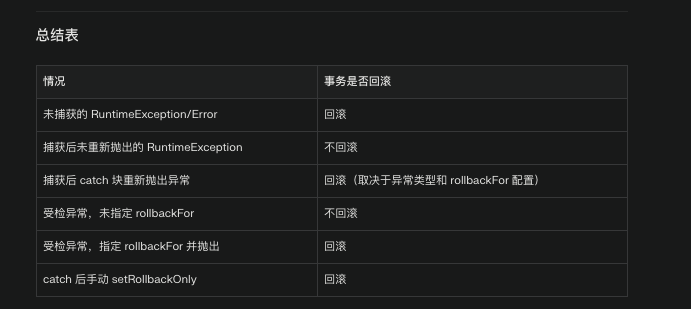

# SpringBoot事务传播机制

主要针对@Transactional注解。

## 1. 关于事务的回滚

在 Spring Boot 中，`@Transactional` 注解默认只会在方法抛出 *未被捕获* 的 `RuntimeException`（及其子类）或 `Error` 时自动回滚事务。如果你在方法内部使用了 try-catch 并捕获了异常（无论是运行时异常还是受检异常），且没有在 catch 块中重新抛出异常，则 Spring 事务管理器无法感知到异常的发生，事务会被正常提交，不会回滚

- **如何保证事务回滚**
  - **catch 后重新抛出异常**：在 catch 块中将异常重新抛出，Spring 事务管理器就能感知到异常，事务会回滚

### 详细说明

**1. 默认回滚行为**

- `@Transactional` 默认只对未捕获的 `RuntimeException` 和 `Error` 进行回滚[1](https://stackoverflow.com/questions/16421508/how-to-rollback-spring-transaction-when-an-exception-is-thrown)[2](https://wynnt3o.hashnode.dev/spring-transactional-rollback-handling)[5](https://dev.to/wynnt3o/spring-transactional-rollback-handling-hc8)[7](https://www.initgrep.com/posts/java/spring/Spring-data-transactional-rollback)[8](https://blog.csdn.net/manonggeerdan/article/details/124959685)[10](https://www.cnblogs.com/CF1314/p/16673308.html)[12](https://blog.csdn.net/qq_28545605/article/details/121647656)。
- 如果方法抛出受检异常（如 `Exception`），事务不会自动回滚，除非你在注解中指定 `rollbackFor = Exception.class`[1](https://stackoverflow.com/questions/16421508/how-to-rollback-spring-transaction-when-an-exception-is-thrown)[10](https://www.cnblogs.com/CF1314/p/16673308.html)[12](https://blog.csdn.net/qq_28545605/article/details/121647656)。

**2. try-catch 导致事务不回滚的原因**

- 如果你在 `@Transactional` 方法内部用 try-catch 捕获了异常，并且没有在 catch 块中重新抛出异常，异常就不会被 Spring 的事务切面感知到，事务会被正常提交[1](https://stackoverflow.com/questions/16421508/how-to-rollback-spring-transaction-when-an-exception-is-thrown)[2](https://wynnt3o.hashnode.dev/spring-transactional-rollback-handling)[5](https://dev.to/wynnt3o/spring-transactional-rollback-handling-hc8)[6](https://www.cnblogs.com/better-farther-world2099/articles/14986156.html)[8](https://blog.csdn.net/manonggeerdan/article/details/124959685)[10](https://www.cnblogs.com/CF1314/p/16673308.html)[12](https://blog.csdn.net/qq_28545605/article/details/121647656)[14](https://www.cnblogs.com/architectforest/p/13822505.html)[16](https://www.ctyun.cn/zhishi/p-229236)。
- 这适用于所有异常类型（包括运行时异常和受检异常）。

```java
@Transactional
public void doSomething() {
    try {
        // 数据库操作
        throw new RuntimeException("出错了");
    } catch (Exception e) {
        // 异常被捕获并处理
        // 没有重新抛出
    }
    // 此时事务会被提交，不会回滚
}

@Transactional
public void doSomething() throws Exception {
    try {
        // 数据库操作
        throw new Exception("出错了");
    } catch (Exception e) {
        throw e; // 重新抛出
    }
    // 事务会根据异常类型决定是否回滚
}

@Transactional
public void doSomething() {
    try {
        // 数据库操作
        throw new RuntimeException("出错了");
    } catch (Exception e) {
        TransactionAspectSupport.currentTransactionStatus().setRollbackOnly();
    }
    // 即使异常被捕获，事务也会回滚
}
```




## 2. 关于事务回滚的传播

- 在Spring事务管理中，如果一个事务过程中出现了异常（特别是未捕获的`RuntimeException`或`Error`），Spring会将当前事务标记为“rollback-only”状态，意味着这个事务只能回滚，不能提交。
- 如果在事务内部的方法中捕获了异常并继续执行（比如外层catch住了异常并没有重新抛出），Spring会在方法执行结束准备提交事务时发现该事务已被标记为“rollback-only”，此时就会抛出`UnexpectedRollbackException`异常

### 典型场景

- 你有一个带有`@Transactional`注解的方法，里面调用了另一个也带有`@Transactional`的方法（默认传播行为是`REQUIRED`）。
- 内层方法抛出异常，外层方法catch住异常并继续执行。
- Spring事务管理器已经把事务标记为rollback-only，但外层方法没有抛出异常，导致Spring在提交事务时发现不能提交，只能回滚，于是抛出`UnexpectedRollbackException`

### 关键点

- 这个异常不是因为代码逻辑错误，而是Spring事务机制的正常行为，用于提醒开发者事务已经被回滚但你还想提交。
- 传播行为（Propagation）为`REQUIRED`时，内外层方法共用同一个事务，任何一层标记为rollback-only，整个事务都只能回滚[1](https://stackoverflow.com/questions/19349898/unexpectedrollbackexception-transaction-rolled-back-because-it-has-been-marked)[2](https://dev.to/thellu/understanding-transaction-rolled-back-because-it-has-been-marked-as-rollback-only-in-spring-52e5)[3](https://dev.to/wynnt3o/spring-transactional-rollback-handling-hc8)。

### 解决建议

- 如果你希望内层异常不影响外层事务，**可以把传播行为改为`REQUIRES_NEW`**，让内外层事务隔离[1](https://stackoverflow.com/questions/19349898/unexpectedrollbackexception-transaction-rolled-back-because-it-has-been-marked)。
- 如果你catch住异常后不希望回滚外层事务，可以在catch块中清除rollback-only标记（不推荐，容易导致数据不一致）。
- 更推荐的做法是：catch住异常后根据业务需要决定是否重新抛出，或者将需要分离的操作放到新事务中执行。


## 3. @Transcational注解使用Tips

- 注解方法必须为public，private方法加注解无效（Spring Boot实现机制导致）
- 注解方法被调用的时候，必须是跨service调用，否在SpringBoot的事务管理器无法捕捉到调用