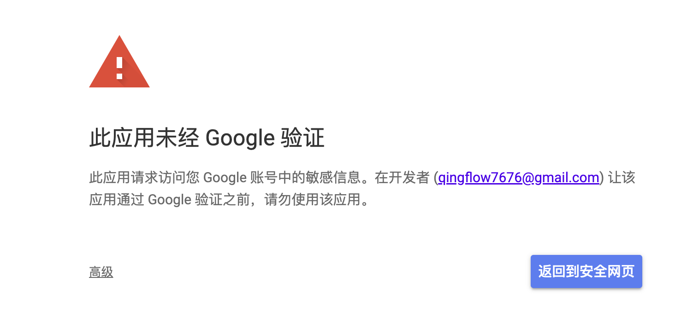

# 谷歌登录对接

## 步骤

### 1. 创建Google App

https://console.cloud.google.com/auth/overview?inv=1&invt=Abz-Lw&project=alien-clover-462802-q1

**在 Google Cloud Console 创建 OAuth 客户端凭据**

- 登录 Google Cloud Console。
- 进入“API 与服务” > “凭据”页面。
- 点击“创建凭据” > 选择“OAuth 客户端 ID”[2](https://developers.google.com/identity/protocols/oauth2)[5](https://ai.google.dev/palm_docs/oauth_quickstart)[6](https://developers.google.com/identity/protocols/oauth2/native-app)。
- 选择应用类型（如“桌面应用”、“Android”、“Web 应用”等）[5](https://ai.google.dev/palm_docs/oauth_quickstart)[6](https://developers.google.com/identity/protocols/oauth2/native-app)。
- 填写必要信息（如应用名称、包名、SHA-1 指纹等，具体视平台而定）[6](https://developers.google.com/identity/protocols/oauth2/native-app)。
- 点击“创建”，下载生成的 `client_secret.json` 文件[5](https://ai.google.dev/palm_docs/oauth_quickstart)[6](https://developers.google.com/identity/protocols/oauth2/native-app)。

**2. 配置 OAuth 同意屏幕**

- 在“API 与服务” > “OAuth 同意屏幕”中，选择用户类型并填写应用信息[5](https://ai.google.dev/palm_docs/oauth_quickstart)。
- 添加测试用户（如你的 Google 账号），保存设置

### 2. 前后端SDK

### 3. 整体流程

1. 前端调用后端接口，获取Google配置，跳转到Google OAuth认证路由
2. 用户在Google OAuth 页面登录Google账号，点击确认授权，然后Google会跳转回创建Google App时设置的redirectUrl
3. 后端获取accessToken和refreshToken获取用户在Google的accountId、email、phone等信息，用于关联自己系统的账号和Google账号
4. 关联账号之后，要么注册、要么登录，然后给前端返回自己系统的用户信息

## 关键点

- Google App申请验证的时候，需要有**隐私协议和用户协议**，且协议必须在网站首页有链接可以进入，同时icon的尺寸要是120*120像素，体积也有限制（好像是1mb）
- Google App验证的之后，申请的权限scope有不敏感和受限的区分，申请受限的权限，需要额外验证，否则就算通过了App的验证，也会进入Google的受限页面
  - 
- 推荐scope只选择最基本的：
  -  scope: 'https://www.googleapis.com/auth/userinfo.email https://www.googleapis.com/auth/userinfo.profile',
  - 这两个scope是不需要验证的